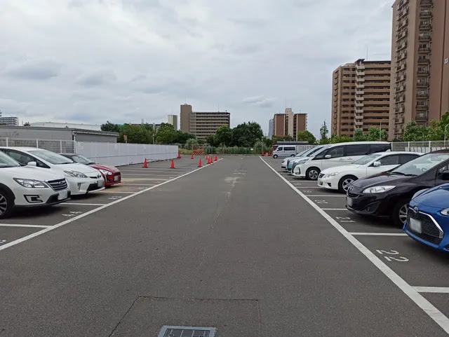

---
categories:
  - 旅行
date: "2025-02-15T23:44:14+09:00"
description: 大阪市の淀川下流、海老江下水処理場に併設された大阪市下水道科学館に行きました。大阪市の近代下水道事業着手100周年を記念して建設され、令和4年4月1日にリニューアルオープン。タッチパネルやプロジェクションマッピング、ゲームなどを楽しみながら下水道のことを学べる科学館です。
draft: false
images:
  - images/og-img.webp
summary: 大阪市の淀川下流、海老江下水処理場に併設された大阪市下水道科学館に行きました。大阪市の近代下水道事業着手100周年を記念して建設され、令和4年4月1日にリニューアルオープンし、タッチパネルやプロジェクションマッピング、ゲームなどを楽しみながら下水道のことを学べる科学館です。
tags:
  - 科学館
  - 大阪
  - 家族でお出かけ
title: 大阪市下水道科学館を見学
---

大阪市の淀川下流、海老江下水処理場に併設された大阪市下水道科学館に行きました。大阪市の近代下水道事業着手100周年を記念して建設され、令和4年4月1日にリニューアルオープンし、タッチパネルやプロジェクションマッピング、モーションキャプチャを使ったゲームなどを楽しみながら下水道のことを学べる科学館です。

## アクセス



電車だと最寄り駅の阪神本線「淀川」駅より徒歩約7分とそこそこ歩きます。東西線、大阪メトロの駅からは徒歩15分とやや遠いです。

車の場合は、駐車場が少しわかりにくいですが大阪市下水道科学館から海老江下水処理場を挟んで南に40台程度停められる駐車場があります。駐車場は無料です。

## 利用料

無料です。駐車場も無料です。

## 館内案内

館内は地下1階から6階まであり、2階以外を見学できます。4階のゲームのように遊べる展示が見どころです。

## 入口には大きなマンホールの絵が

駐車場に車を停めて大阪市下水道科学館の前に来ました。入口前に広場のような場所が。

何か床に絵が書いてあるなと思いながら通ると、、、

なんと、巨大なマンホールの絵だったようです。こんなデザインのマンホールがあるのですね。これまで全然気づいてませんでした。

あと、こんなおもしろ写真を撮る場所もありました。

## 3F ゲスイドウのキレイとハテナシアター

館内に入ったら、階段で上の階にいきます。2階は事務室なので3階から。

まずはイントロダクション的な下水道の歴史です。

次にシアターで説明を見ます。

素敵なレゴの展示もありました。

 

## 4F 下水道って何だろう？

4階は展示がたくさんあり、一番の見どころです。ボタンやiPadのようなものを操作して、スクリーンに映る絵が変わるような展示が多いです。クイズだったり、なかなか楽しめます。

入口の絵にあったマンホールも展示されていました。

モーションキャプチャを利用した展示もあり、飛び跳ねたり踊ったりしてゲームをクリアするようなもので、子供たちは喜んで一生懸命やってました。

これはドローンで下水管に入り、水で汚れを落とすゲームです。館内はそれほど人数が多くなかったですが、これは一番人気で常に次の人が待っていました。

スタンプラリーもあり、隠れた場所にスタンプがあるので展示を見学しながら探していくのも楽しいです。

スタンプは、銀色の厚紙をプレスして凹凸を付けるもので、マンホールの金属感と凹凸を再現してクオリティが高いです。

## 6F サンルーム

5階は特別展示のような感じでしたがゲームなどは無く、6階に上がります。6階は外に出て屋上のような感じです。ここでモジモジ君（古い）のような人文字の写真を撮ることができます。

## B1F キン肉マンのマンホール

最後は地下一回まで下ります。ここには何故かキン肉マンのマンホールがありました。

## まとめ

大阪市下水道科学館は、下水道のことをゲーム感覚で楽しく学べる場所でした。入館も駐車場も無料なのが嬉しいですね。
