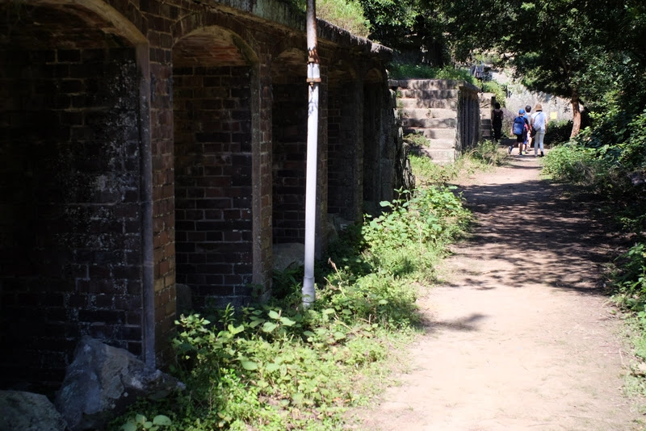
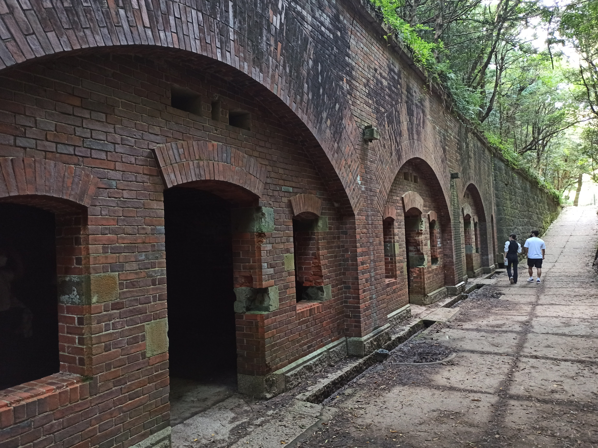

---
categories:
  - アウトドア
  - 旅行
date: "2025-02-15T23:43:28+09:00"
description: 大阪湾の入口、和歌山県加太と淡路島の間に浮かぶ無人島、友ヶ島をレポートします。戦時中の砲台跡などが残っておりラピュタのような景色を見ることができます。加太港からフェリーで約20分とお手軽に行けるため日帰り観光におすすめです。
draft: false
images:
  - images/2hUmz.jpg
summary: 大阪湾の入口、和歌山県加太と淡路島の間に浮かぶ無人島、友ヶ島には戦時中の砲台跡などが残っておりラピュタのような景色を見ることができます。加太港からフェリーで約20分とお手軽に行けるため日帰り観光におすすめです。
tags:
  - 友ヶ島
  - 和歌山
  - フェリー
title: 戦争遺跡とラピュタの世界 友ヶ島
---

大阪湾の入口、和歌山県加太と淡路島の間に浮かぶ無人島、友ヶ島には戦時中の砲台跡などが残っておりラピュタのような景色を見ることができます。加太港からフェリーで約20分とお手軽に行けるため日帰り観光におすすめです。

## 場所はどこにあるの？

和歌山県の加太港よりフェリーが出ています。フェリー乗り場へは、南海電鉄加太駅から徒歩、車の場合はフェリー乗り場に駐車場（有料700円）があります。フェリー乗り場までの道は車1台がぎりぎり通れる程度の狭い道を通るため注意です。



## 友ヶ島汽船 フェリー乗り場

県道65号を北から進み、加太港が見えたカーブを左に細い道に入ります。いちおう看板が出ていた気がします。そこから左右家に挟まれた細い道を気をつけながら進んでいくとフェリー乗り場駐車場に着きます。道は狭いですが案内板が出ているので迷うことは無いと思います。

細い道を進んでいくとフェリー乗り場の駐車場に付きました。11時前の到着でしたが、かなり車が埋まっています。出入り口は1台分の車幅しか無いので出る車と入る車が滞留していましたが無事停めることができました。

## フェリーで友ヶ島へ

11時の便は既に満席で、12時の便の予約券をもらいました。しばし待ちです。

加太港をぶらぶらして時間を潰します。フェリー乗り場は小さな港で、防波堤から見るとかわいらしい感じです。

船や釣り人を見たり、港内の海を覗いて小魚をみたりして1時間ほど待ち、きっぷを購入します。

料金は下記でした。

|   | 料金  |
|:-:|:-:|
| 大人  | 2,500円  |
| 小人  | 1,250円  |

フェリーに乗り込みます。ご覧の通り、かなり人が多く満員です。大阪から近い無人島で観光スポットもあるので人気なのですね。

ともがしま号です。もう一つ小さいラピュタ号というのもあります。

出港し、加太漁港の赤灯台を超えて外海へ出ていきます。この防波堤はよく釣れるらしく釣り人でいっぱいでした。

友ヶ島に近づいてきました。フェリーの着く野奈浦桟橋は反対側にあるので島の裏側へ回っていきます。

左の虎島と右の沖ノ島の間は潮が引いていると渡れたそうですが、散策マップでは「非常に危険です」と書かれているので今は渡ることができないようです。ちなみに友ヶ島はこれら2つを含む4つの島の総称で、フェリーでこれから向かうのは沖ノ島です。ややこしいので以下友ヶ島＝沖ノ島とします。

友ヶ島に着きました。

## 砲台跡と友ヶ島めぐり

### 野奈浦桟橋から海の家

野奈浦桟橋から島へ入るとたくさんの人で溢れています。無人島というよりメジャーな観光地といった感じです。

フェリー乗り場でもらえる島のマップを見ながら歩いていきます。

コロナの影響からか、島の東側への道は封鎖されており、キャンプ場や深蛇ヶ池方面には行けませんでした。なので、西へ行き海の家から山に登り第5砲台跡、タカノス展望台、第3砲台跡を経て野奈浦桟橋へ戻るコンパクトなコースを歩きます。

少し西へ歩くと海の家です。きれいに整備されていてボートなどもあるのでマリンスポーツでもできるのでしょうか。

ここから山に入っていきます。しばらく運動不足の体にはつらい上りが続きます。

### 第2砲台跡

山に登っていくと第2砲台跡に着きました。大阪湾への入口に位置する友ヶ島は、戦時中には要衝だったのでしょう。

さらに登りが続きます。子供ともどもヘトヘトです。

小展望台です。辛い登りはもうすぐ終わりです。

### タカノス山展望台でお昼ご飯

タカノス山展望台に着きました。

ベンチと屋根があるのでここでおべんとうを食べます。

展望が良く、淡路島がすぐ近くに見えます。

島の北側には神島が浮かんでいます。

トンボがたくさん飛んでいたので子どもたちは捕まえようと追いかけていました。

### 第3砲台跡

腹ごしらえをしたら展望台のすぐ下、観光のメインになる第3砲台跡に入ります。階段で地下へ入っていく入口でした。

事前に調べたら懐中電灯を持っていったほうが良いとの情報でしたが、暗いものの電気が付いていたりするので持っていなくても大丈夫そうです。

開けた場所に出ました。中央が池のような湿地のような場所です。

ここが良く写真で紹介されている場所です。ラピュタみたいと言われるとそんな気もしますが、見たのもうだいぶ前なのでよく思い出せません。。。

宿舎もボロボロですが残っています。戦争中のこの島での生活はどのようなものだったのでしょうか。

ここから先、下ると野奈浦桟橋へ戻ります。途中に東へ行く道がありますがコロナの影響か閉鎖されていました。

## 帰りのフェリー最終便にはご注意

すぐにフェリーが来ました。14:30の便で帰ります。最短のコースで回った感じなので、おべんとうを食べても2時間程度で回れてしましました。フェリーは1時間ごとの運行で、最終便は16:30なので注意しましょう。

友ヶ島を見ながら20分、加太港へ着き今回の旅行は終了です。

## まとめ

友ヶ島は旧日本軍の戦争遺跡、砲台跡などを見ることができ、なかなか興味深い観光ができる無人島でした。広い島ではないので、特に東側が閉鎖中だったので3時間くらいあれば十分に回れてしまいます。桟橋には魚がたくさん見えたのでコロナ渦が終わりキャンプ場が使えれようになったら釣り＋キャンプで行くのも楽しそうです。
