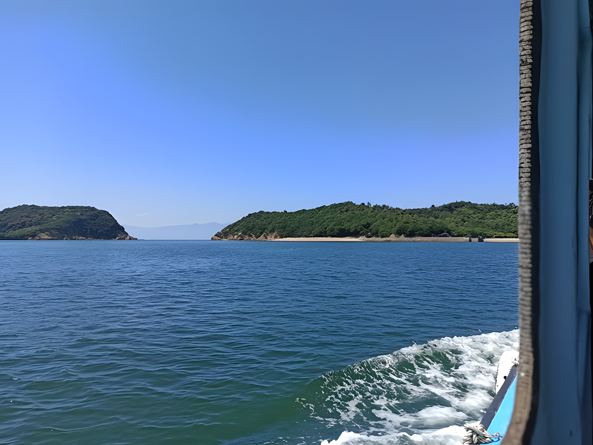
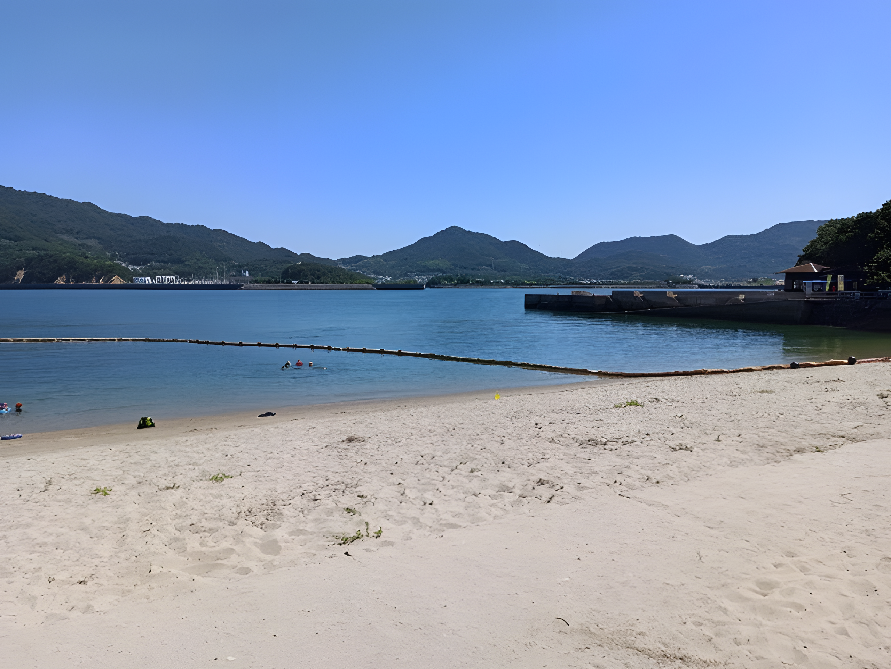
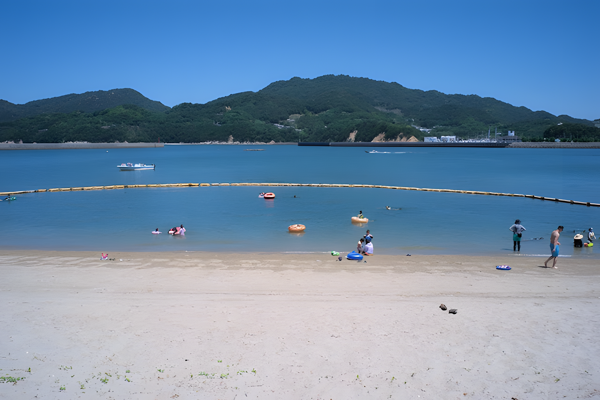
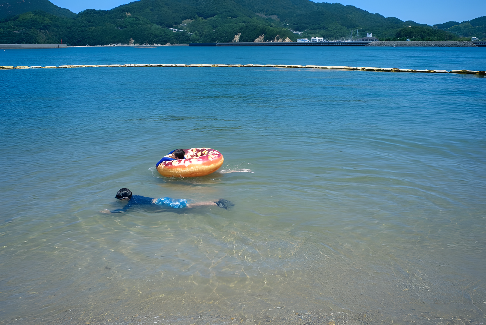
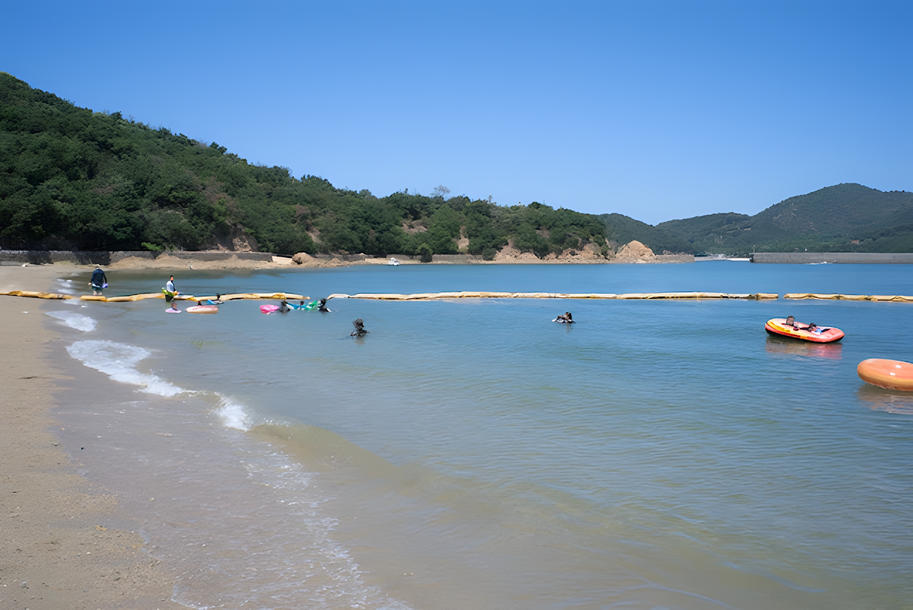
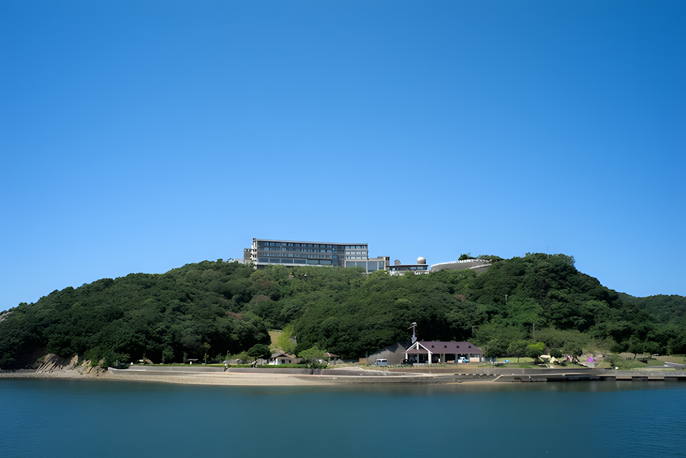
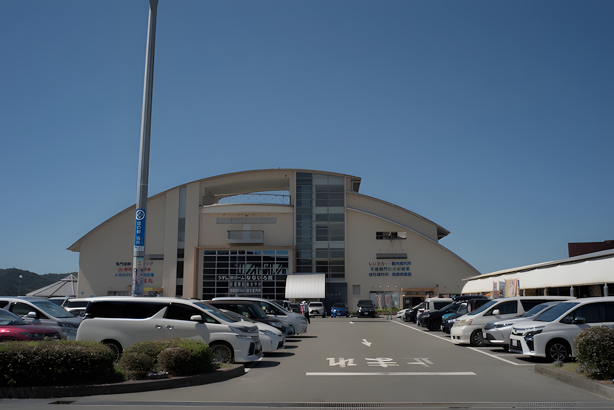
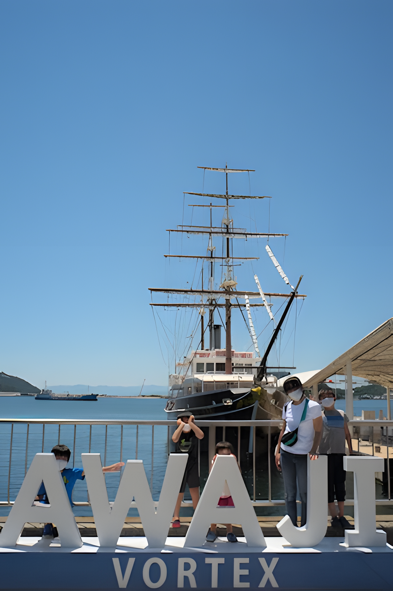
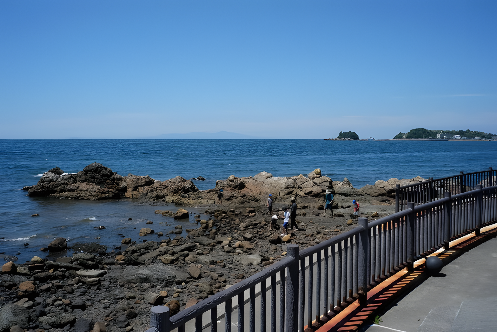

---
categories:
  - アウトドア
  - 旅行
date: "2025-02-15T23:43:23+09:00"
description: 暑い夏の晴れた日に瀬戸内海に浮かぶ無人島、蔦島で海水浴をしました。大阪から瀬戸大橋を渡り香川県の蔦島へ。その後明石海峡大橋を渡り淡路島の休暇村南淡路に一泊してうずしおを見た旅行記です。
draft: false
images:
  - images/tsutajima.webp
summary: 暑い夏の晴れた日に瀬戸内海に浮かぶ無人島、蔦島で海水浴をしました。大阪から瀬戸大橋を渡り香川県の蔦島へ。その後明石海峡大橋を渡り淡路島の休暇村南淡路に一泊してうずしおを見た旅行記です。
tags:
  - 蔦島
  - 淡路島
  - 島
  - 海
  - 香川
title: 無人島の蔦島で海水浴と鳴門海峡うずしおクルーズ
js: js/gmap.ts
---

暑い夏の晴れた日に瀬戸内海に浮かぶ無人島、蔦島で海水浴をしました。大阪から瀬戸大橋を渡り香川県の蔦島へ。その後明石海峡大橋を渡り淡路島の休暇村南淡路に一泊してうずしおを見た旅行記です。

## 観光コース

万博記念公園前の吹田ICを起点にして中国道、山陽道と岡山方面へ進み瀬戸大橋を渡り香川県に入ります。三豊鳥坂ICより西へ仁尾港の渡船乗りまで約20分。

帰りは高松道を、瀬戸大橋を渡らず東へ進み大鳴門橋を渡り淡路島へ。淡路島南ICで高速を降りて休暇村南淡路で1泊。翌日うずしおクルーズに乗ってから少し寄り道をし、明石海峡大橋を渡り吹田ICへ戻りました。

{{< gmap json="track.json" center="{ \"lng\": 134.591409, \"lat\": 34.402462 }" zoom="9" style="46b4720545513a2c" >}}

## 蔦島（つたじま）とは？

蔦島は、香川県三豊市の仁尾港の西に浮かぶ無人島です。大蔦島と小蔦島の2つの島からなり、仁尾港から大蔦島へ渡船があります。以下、大蔦島のことを蔦島と呼ぶことにします。

端から端まで1km程度の小さな島で、夏のメインは海水浴や釣りでしょうか。海水浴場につたじまキャンプ場があり、キャンプのできるようです。内陸へ入る遊歩道があり、大観亭などの景勝地や天狗神社があります。

## 仁尾港から渡船で蔦島へ

大阪から瀬戸大橋を渡り香川県へ。明石海峡大橋を渡る方が近いみたいですが、まだ明石大橋が無く子供の頃、社会の教科書に載っていた瀬戸大橋を一度渡ってみたかったので瀬戸大橋経由で行きました。運転なので写真を撮れず残念。

ということでいきなり仁尾港です。写真の渡船事務所でお金を払います。この事務所の裏が駐車場になっています。渡船時間は8:30～16:45で大人400円、小人(6歳～12歳)200円と格安です。

蔦島（つたじま）海水浴場＆キャンプ場に関しては
[三豊市観光交流局のサイト](https://www.mitoyo-kanko.com/photoinfo/swimming-spots/)
を参照ください。

料金を払い待っていると小さなかわいらしい船が蔦島から帰ってきました。

出発時間は決まっておらず、客が来たら都度出発のようですが、何人は既に待っており、船も小さいのですぐ出発しました。船内は小さくて10人～20人も入れないのではないでしょうか。

左奥に見えるのが小蔦島、右奥が行き先の大蔦島です。見たとおりすぐ近くなので渡船時間も7分で着いてしまいます。

桟橋に着き、すぐ目の前にある海水浴場へ。海水浴場から見た桟橋です。海を隔てた仁尾港はすぐ近くですね。

## つたじま海水浴場

つたじま海水浴場の全景です。見れば分かるとおり小さな海水浴場です。範囲は狭いですがそれほど人が来るわけではないので十分楽しめます。瀬戸内海だからか波が穏やかでした。

砂浜の砂は大粒で、裸足だと痛いです。ただ、よく管理され人も少ないからかゴミなどはほとんど無くきれいな砂浜です。

海は緑がかった色で透明度はそれほど高くありませんが、決して汚いわけではなくきれいな海です。瀬戸内海で泳ぐのは初めてなのですが、こういう海なのでしょうか。日本海、太平洋とはまた違いますね。魚は始めのうちキスが泳いでいるのが見えましたが、人が多くなってくるといなくなりました。

海岸の左、島の北側です。道が続いているわけではなく、途中から岩場になって進めません。海水浴場の少し奥で釣りをしてみましたがキスが1匹釣れたのみでした。

島の奥に続く道もあり、行ってみたいと思いましたが真夏の暑さで断念。またの機会にしたいと思います。

## 休暇村南淡路で一泊

2,3時間遊んで蔦島を後にし、淡路島へ向かいます。いつもはキャンプですが今回は優雅に宿に宿泊です。夕飯の海の幸に舌鼓をうち、屋上では巨大な望遠鏡で金星を見ることができたり、すばらしい宿でした。

下の写真は次の日のうずしおクルーズから休暇村南淡路を見た写真です。高台で展望も素晴らしかったです。海辺にはキャンプ場が見えますね。休暇村南淡路シーサイドオートキャンプ場です。なかなか予約が難しいキャンプ場ですが素晴らしいロケーションなのでいつかキャンプでも訪れてみたいです。

## うずしおクルーズ

2日目は、休暇村南淡路からすぐのうずしおクルーズです。実はこのうずしおクルーズ、淡路島側と徳島側の両岸から出ています。よく知らず間違えて徳島側の便を予約してしまっていて慌てて電話でキャンセル。出発間近で淡路島の乗り場にいます、と平謝り。

徳島側は空いていて予約取りやすいようですね。淡路島側の11時の便を運良く予約できたのでお土産見たり足湯に浸かったりして時間を潰し、待ちに待った出発です。

うずしおの見られる時間は毎日、満潮前と干潮前の潮の動くピンポイントの時間帯だけで、乗った時間はちょうどうずしおが終わるころだったのですが、それでもすごく速い潮の流れとたまに少しうずが見え、迫力がありました！

終わった後は記念写真です。

## (おまけ)緑の道しるべ 阿那賀公園

なんとなくGoogleマップで近くにあり気になった「緑の道しるべ阿那賀公園」へ寄ってみます。海沿いの道に突如として数台の駐車スペースがあり、ぽつんとアンモナイトの銅像があります。

海辺に下りられますがゴツゴツした石があるだけで生き物もあまりいなく、海はあまりきれいでもなく、釣りしている人もいましたが水深も非常に浅いので全く釣れている様子もありませんでした。

## 岩屋で釣り

最後は〆に淡路島北端の岩屋海水浴場の堤防で少し釣りをしました。

釣果はベラとフグのみ。。。

ここの海水浴場はこじんまりとしていて家族で楽しむには良さそうなビーチですね。

釣りをしたり子供が少し水遊びをしたりしていたら夕方になり、明石海峡大橋を渡り今回の旅行は終了です。

## まとめ

蔦島は気軽に渡船で行け、無人島で海水浴という非日常的な気分を味わえる島でした。瀬戸内海の穏やかな海を見て、泳いで日頃のストレスをリフレッシュできました！

明石海峡のうずしおクルーズもぜひ一生に一度は乗ってみる価値ありだと思います。
