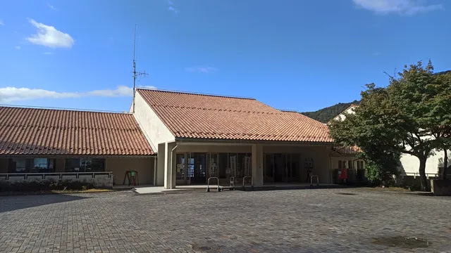

---
categories:
  - アウトドア
  - 旅行
date: "2025-02-15T23:43:56+09:00"
description: 国立若狭湾青少年自然の家で鯖の「なれずし」という伝統料理を作り、さらにシーカヤックもできる面白そうなイベントに参加したのでレポートします。
draft: false
images:
  - images/017.webp
summary: 国立若狭湾青少年自然の家で鯖の「なれずし」という伝統料理を作り、さらにシーカヤックもできる面白そうなイベントに参加したのでレポートします。
tags:
  - 青少年自然の家
  - 若狭
  - 福井
  - 海
title: 国立若狭湾青少年自然の家「親子でなれずし作り」体験
---

夏に国立室戸青少年自然の家に行き、格安で素晴らしい体験をできたので他の青少年自然の家で家族で行けるイベントを探していたところ、国立若狭湾青少年自然の家で鯖の「なれずし」という伝統料理を作り、さらにシーカヤックもできる面白そうなイベントがあったので申込みました。

## 国立若狭湾青少年自然の家とは

独立行政法人国立青少年教育振興機構が管理運営する宿泊型の青少年研修施設です。全国に14ヶ所ある青少年自然の家のうち、第9番目として昭和59年に設置されました。

下図の衛星写真を見ると分かります通り、若狭湾の浜に面しているためシーカヤックやスノーケリング、磯遊びなど海の活動が楽しめます。

## イベントの予約

通常利用する際は、
[ホームページ](https://wakasawan.niye.go.jp/use/process/)
または電話で利用申込みをし、その後利用申込書を提出したり事前打ち合わせなど準備が必要です。その他に年間を通じて青少年自然の家が主催するイベントがあり、こちらはWebフォームで申し込みをするだけで参加できるためお気軽に利用できます。

今回は家族向けのイベント、若狭地域の食文化体験「親子でなれずし作り」に申し込みをしました。

4食付きで宿泊、体験料も含み大人3,100円（子供も同程度）と安すぎです。

## アクセス



大阪、京都方面からは名神高速道路京都東ICより国道161湖西道路を北へ、途中で1つ西の国道367鯖街道を通るか湖西道路をそのまま通り琵琶湖北側で国道303（これも鯖街道）を日本海へ抜けます。日本海沿いの国道162号のトンネルを抜けてすぐ左に黒崎半島へ入るとその先に国立若狭湾青少年自然の家があります。

## 初日：なれずし作りとシーカヤック

なれずし作りは青少年自然の家から少し離れた田烏の小学校跡地で行うため、集合場所は小学校跡地です。



小学校だった建物の中に入り受付をします。

「さかなの学校うちとみKitchen」と可愛らしい看板です。

### なれずし体験一日目

なれずしとは、鯖を米ぬかで発酵させた「へしこ」にご飯を詰めてさらに発酵させたものです。一般的い想像するお寿司とはかなり違います。滋賀県の琵琶湖特産である鮒ずしに近いものがあります。

説明を聞き、上の教室で体験です。まずは米ぬかまみれの「へしこ」の登場です。4月頃に仕込んだものだそう。

米ぬかを落としていきます。

身の中にも米ぬかが入っています。

さらに水できれいに洗って、、、

皮を剥きます。鯖には透明の厚い皮があり、下の写真は剥いたあとの鯖です。右下に皮があります。

今日はここまで。これを一日かけて水で戻してくれるそうです。

### お昼ごはんはへしこうどん

お昼ごはんは近くの民宿「佐助」さんでへしこうどんと焼き鯖です。塩辛いへしことうどんが合います。

### 青少年自然の家にチェックイン後にシーカヤック体験

車で5分程度で国立若狭湾青少年自然の家に到着です。

部屋は和室で20畳もある大きな部屋でした。

窓からは若狭湾がよく見えます。

少し休憩し着替えたら外に出てシーカヤックです。

説明を聞いてパドルを持ったら浜へレッツゴー！

パドルの使い方を練習したらシーカヤックを海辺まで引っ張りだします。

人生初のシーカヤックです。子供もドキドキです。

なんとか出港できました。池や湖とかにある貸しボートと違いパドルが1本で左右つながっているため操作に少し難儀しますが、すぐにそれなりには漕げるようになりました。11月なので寒いかと思ってましたが運良く晴れの日で暖かく、濡れるのも下半身のみなので快適です。子供もとても楽しみ良い体験でした。

### 周りを散策し夜ごはん

シーカヤックのあとは夜ごはんまですこし海辺の道を散策したりして過ごします。

夜ごはんはバイキング形式で、ジュースも飲み放題とつい食べすぎてしまいます。

そのあとは、子供は親から離れクラフト体験をして、親は青少年自然の家の活動内容を聞いて親同士の交流会を少しして就寝です。

## 二日目：なれずし作りの続きとビーチコーミング

### 朝は早いです

朝食の時間は7時からと早いため、ぐうたらしていられません。起きて布団をたたみ朝食を食べたらお部屋の掃除です。

出発まで少し時間ができたので最後に海を見ておきます。

砂浜の端に小さな磯があり、エビやヤドカリがいました。夏であれば海に入り魚もたくさん見ることができそうです。

磯から青少年自然の家を見た写真です。海が近いことがわかりますね。

ここのキャラクターであるTOBEEに分れを告げて出発です。

シーカヤック楽しかった！

 

### なれずし体験二日目

今日もまた小学校跡地に移動します。

機能ふやかした鯖のへしこのお腹を開き、ごはんを詰める作業を体験します。

これを重ねて樽に入れて重しを載せ、2週間程度でできあがりだそうです。

### 海辺でビーチコーミング

なれずし体験のあとは海辺に出て砂浜のゴミ拾い、ビーチコーミングです。

すごい量のプラスチックが散乱していますが地元の方々が取っても取っても流れてくるようで、冬には大きなものもたくさん流れ着くみたいです。プラスチックによる海洋汚染はテレビなどで聞いていましたが実際に拾って、話を聞くと喫緊の課題であることがよく認識できます。

### 最後の昼食は待ちに待った「なれずし」

「佐助」さんで最後の昼食です。

待ちに待った「なれずし」です。これを目当てに来ている方々もいるのですが、発酵食品なので味はかなりクセがあり、2切れくらい食べれば満足かな、と、、、

アルミホイルに包み炙ったものはかなり食べやすくなっていました。子供は、ほとんど食べませんでしたね、、、。お酒のつまみには合いそうです。1本買って後日送ってもらうので日本酒を飲みながら食べてみたいと思います。

へしこを使ったちらし鮨も。ごはんが山盛りです！

ここで最後にビーチコーミングの体験から家族ごとに考えたSDGs宣言をして終了です。2日間ありがとうございました！

## おまけ：帰りに若狭鯖街道熊川宿に寄る

「鯖」の2日間だったので、帰りは鯖街道を通って途中の若狭鯖街道熊川宿に寄って帰りました。

昔の宿場町の風景がいい感じです。

鯖街道には「鯖寿司」のお店がたくさんありますが、「なれずし」は「鯖寿司」とは全然違うものでした。

## まとめ

国立若狭湾青少年自然の家は海が近く、シーカヤックがとても楽しくまた行きたいと思うところでした。特に夏、シュノーケリングをしたら楽しそうです。なれずし体験もなかなかできるものでは無いのでよい思い出になりました。
