---
categories:
  - アウトドア
date: "2025-02-15T23:43:48+09:00"
description: 兵庫県の丹波篠山にあるアウトドアが楽しめる施設、ユニトピアささやまに行ってみました。プール、温泉、キャンプや釣り、宿泊施設などがあるリゾート施設のようなところです。今回は家族でフィールドアスレチックを楽しみました。
draft: false
images:
  - images/IMG_20220529_143252_00_808.jpg
summary: 兵庫県の丹波篠山にあるアウトドアが楽しめる施設、ユニトピアささやまに行ってみました。プール、温泉、キャンプや釣り、宿泊施設などがあるリゾート施設のようなところです。今回は家族でフィールドアスレチックを楽しみました。
tags:
  - アスレチック
  - 兵庫
  - ユニとミアささやま
title: ユニトピアささやまでフィールドアスレチックを楽しむ
---

兵庫県の丹波篠山にあるアウトドアが楽しめる施設、ユニトピアささやまに行ってみました。プール、温泉、キャンプや釣り、宿泊施設などがあるリゾート施設のようなところです。今回は家族でフィールドアスレチックを楽しみました。

## ユニトピアささやまとは

ユニトピアささやまは、27万m2の広大な敷地に宿泊施設や研修棟、キャンプ場のほかフィールドアスレチックやテニスコートなど自然との繋がりを満喫できる施設です。

なぜこんなところにこれほど広大な施設があるかというと、現地の看板に書いてありうろ覚えですがもともと戦時中は陸軍だか空軍の演習場だったようです。その後松下電器産業労働組合が保養所のような形で整備し、現在はパナソニックグループ労働組合連合会が管理しているようです。

## アクセス



## 敷地内マップ

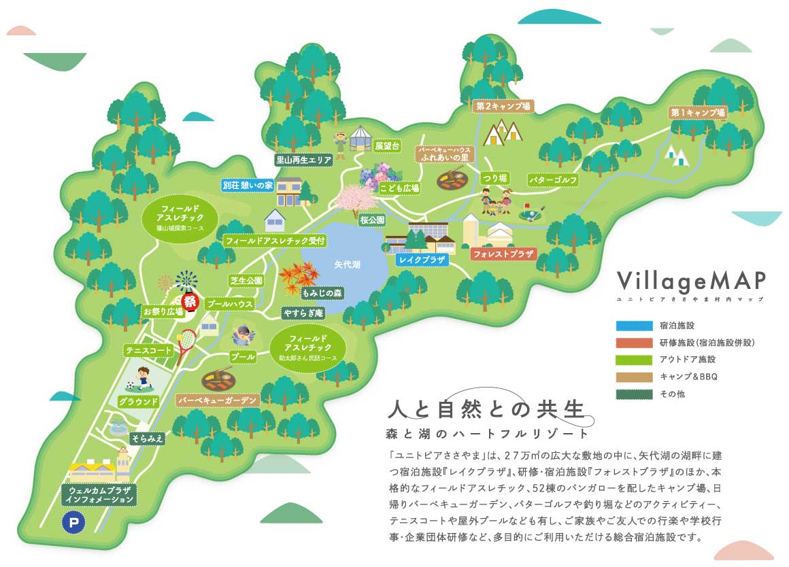

非常に広大な敷地で、受付に駐車場があり、敷地内は徒歩か循環バスに乗って移動します。今回はフィールドアスレチックのところまでしか行きませんでした。歩いて5〜10分くらいでしょうか。

## 駐車場と受付

駐車場は1箇所しかありませんが、非常に広いため満車になる心配はなさそうです。駐車料金は無料です。

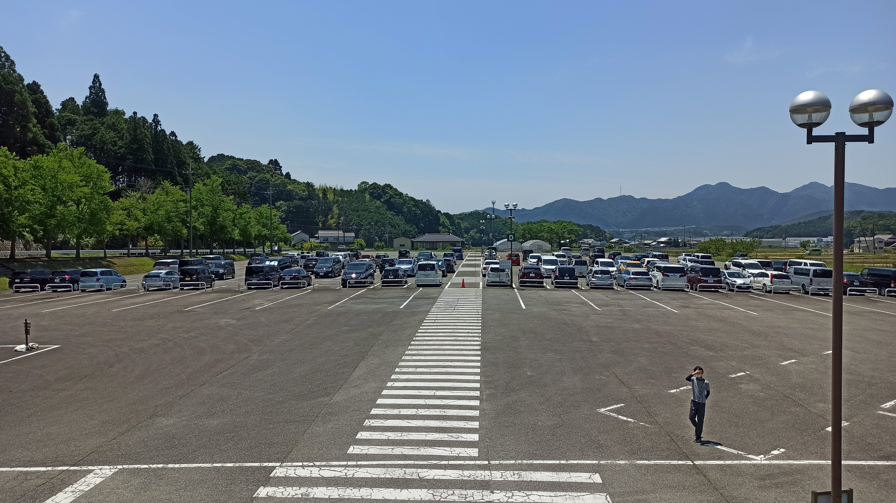

受付で入場用を支払います。大人300円、小人200円と格安ですが、中のフィールドアスレチック、バーベキュー、釣り堀などアクティビティにはそれぞれ料金がかかります。

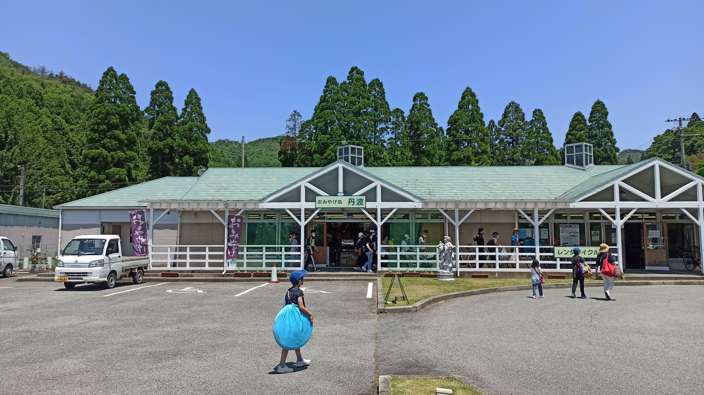

## 施設紹介

受付で定期的に循環バスが走っていますが歩いてみることにします。山の中によく管理されきれいな敷地と道が広がります。

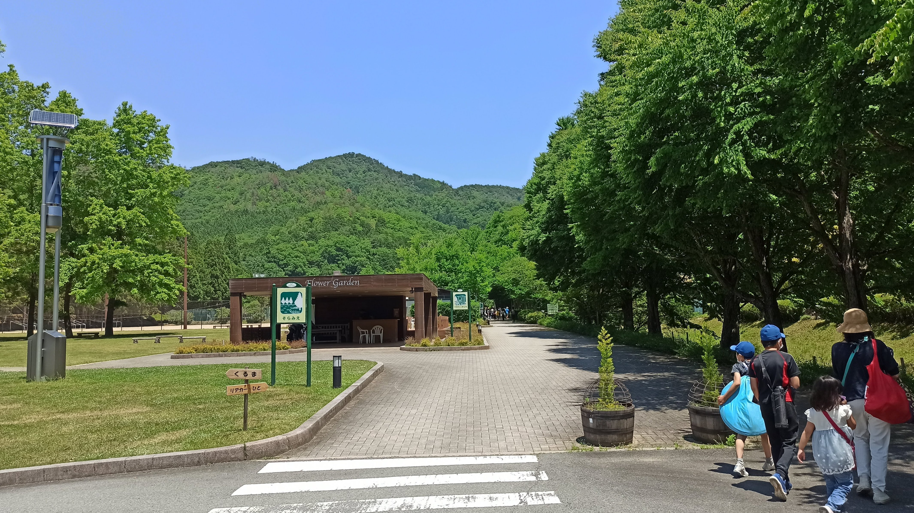

「そらみえ」という広場でしょうか。

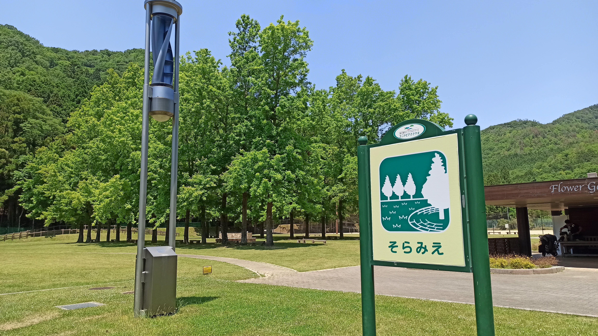

「そらみえ」の隣には「フラワーデッキ」。特にお花は咲いていません。とてもきれいに管理されていますが人はほとんどいなく閑散としています。

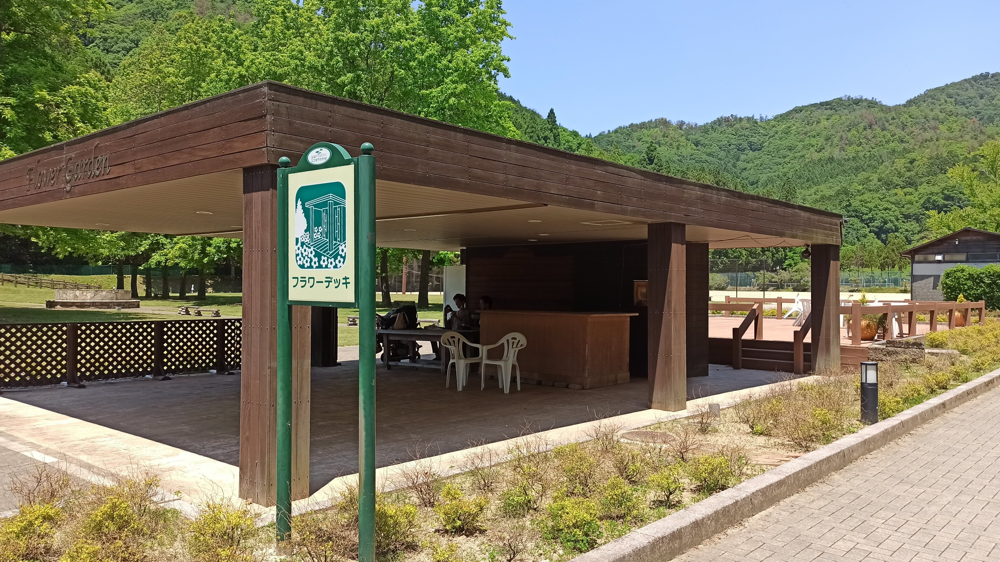

どんどん奥へ進んでいきます。

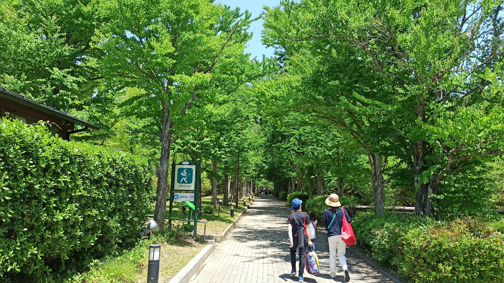

道の左手には大きなグランドとテニスコートです。誰もいません。。。

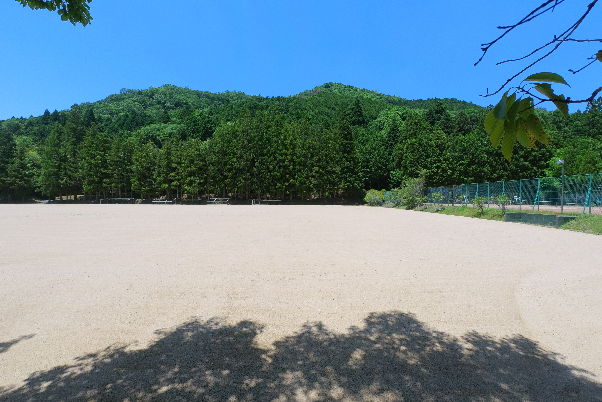

プールです。今の時期はまだ閉まっています。

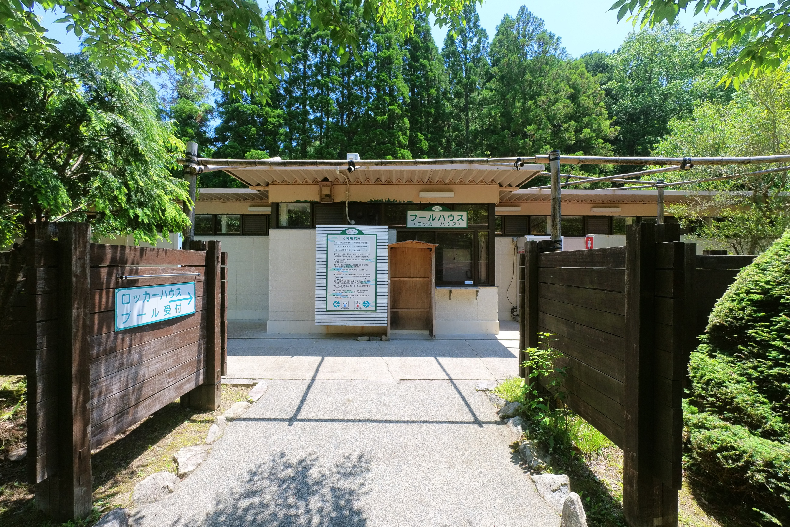

お祭り広場です。イベントとかやることもあるのでしょうか。

芝生公園。きれいな芝生が広がります。

駐車場には車がたくさん停まっていましたがここまでほとんど人がいません。この先のフィールドアスレチックが混んでいました。

## フィールドアスレチック

さらに道を進むと左手にフィールドアスレチックの受付が現れます。受付で料金を支払います。

フィールドアスレチックは「篠山城探訪コース」と「助太郎さん民話コース」2つのコースがあります。

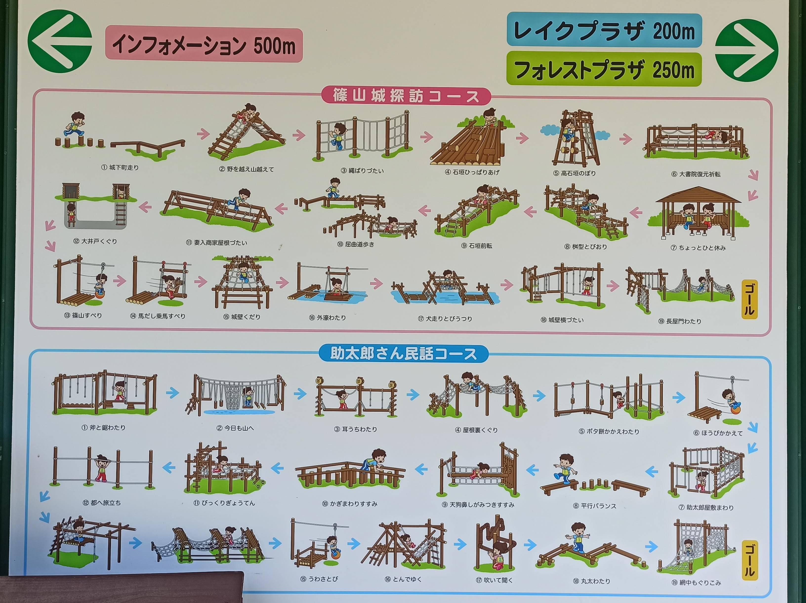

### 篠山城探訪コース

受付のすぐ横に入口があります。山の中を登っていくコースで小さな子供にはちょっと大変かもしれません。

まずは簡単な「城下町走り」で準備運動。

次はアスレチックぽくなってきました。

重りをひっぱって落としたり、

高石垣登りです。

忍者のようにロープを伝っていきます。これは大変そう！

山頂で休憩です。

湖のむこうに宿泊棟が見えます。広い敷地ですね。

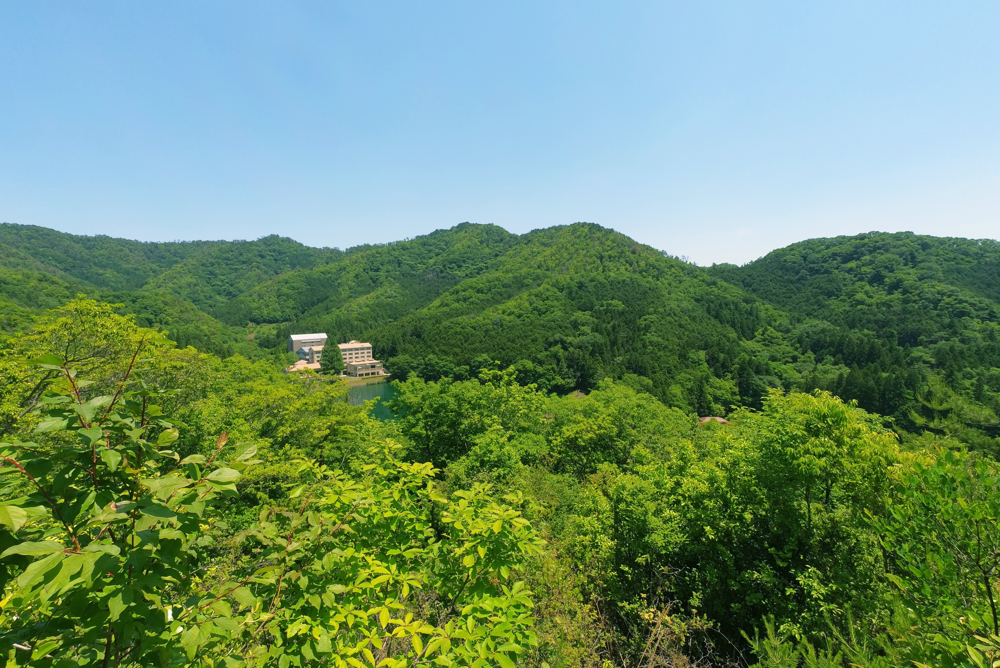

「篠山すべり」公園によくあるやつですが森の中のアスレチックでやるとさらに面白いですね。

山から降りた先には池が。

城のお濠を模した池を船で渡っていきます。

下まで降りて受付に戻りゴールです。

## 助太郎さん民話コース

こちらは受付から道路を挟んだ反対側にあり、広場の中にアスレチックが点在している感じです。

山を登ったりしなくてよいのでどちらかというと小さな子供におすすめです。

アスレチックを満喫したら疲れてしまい、今回はこれで終了し帰宅です。釣り堀やバーベキューでも来てみたいですね。

## まとめ

ユニトピアささやまはなかなか本格的なアスレチックが楽しめる場所でした。これだけでも行く価値はあるのではと思いますが宿泊やキャンプを組み合わせたらさらに楽しめそうな施設です。
