---
categories:
  - 車
  - DIY
date: "2025-02-15T23:43:56+09:00"
description: 小型でリーズナブルな価格、DIYで取付けが簡単なドライブレコーダー、VANTRUE E1を購入しました。取付け方法を解説します。
draft: false
images:
  - images/00.webp
summary: 小型でリーズナブルな価格、DIYで取付けが簡単なドライブレコーダー、VANTRUE E1を購入しました。取付け方法を解説します。
tags:
  - ドライブレコーダー
title: ドラレコをDIYで取付け VANTRUE E1
---

旅行に行く際に車からの景色を残したいと思うようになり、フロントウィンドウにアクションカメラでも取付けられないかと思っていました。

取付けや給電方法などを考えたり、せっかく付けるなら事故が起きたときの記録もできるといい、と考えていたら結局ドライブレコーダーを付けるのが良さそうです。ドライブレコーダーは目的が記録なので、画質がどうかと思いましたが最近のものは画質もなかなか良さそうなのでDIYでドライブレコーダーを取り付けることにしました。

## VANTRUE 小型ドライブレコーダー E1

安くてそこそこ画質も良さそうで、リヤはいらないという条件でAmazonを探していたところ、VANTRUE
小型ドライブレコーダー E1 というのが良さそうです。

キューブ型で小さいながらもSonyの画像センサーを組み込み取付けも簡単そうです。また、マウントからも簡単に取ることができ、本体内の電池で外に持ち出すこともできるようです。さらに別売りでPLフィルターが付けられるためウィンドウの反射も軽減できそう。期待して買ってみました。

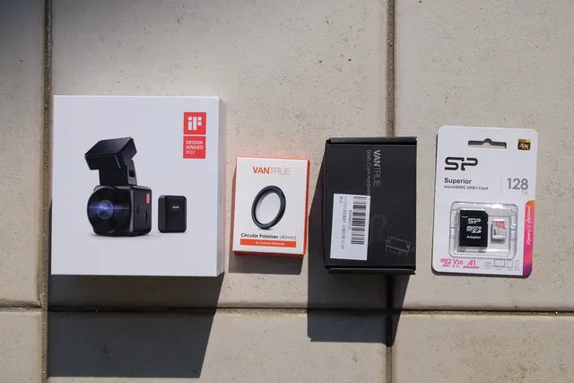

購入したのはドライブレコーダー本体、PLフィルター、ヒューズボックスから電源を取る直結電源ケーブル、そしてMicroSDカードです。電源ケーブルは、本体にシガーソケットに差し込むタイプが付属しているため、今回はとりあえずお試しでシガーソケットを使いました。

箱を開けます。リモコンとケーブル類が入っていそうです。

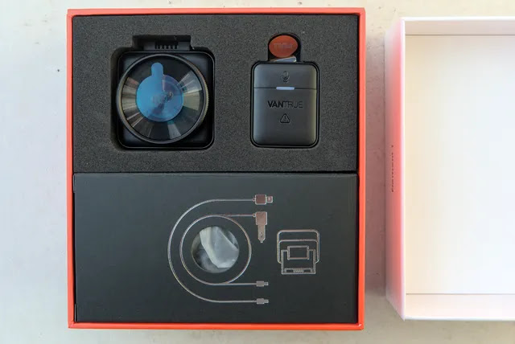

箱の奥には取説とステッカーなども入っていました。英語とフランス語？でしょうか。

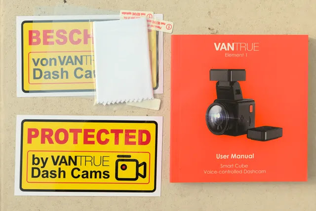

カメラ本体、リモコン、USBケーブルと電源ケーブルです。写真を取り忘れましたが、フロントウィンドウに接着するマウントも入っています。

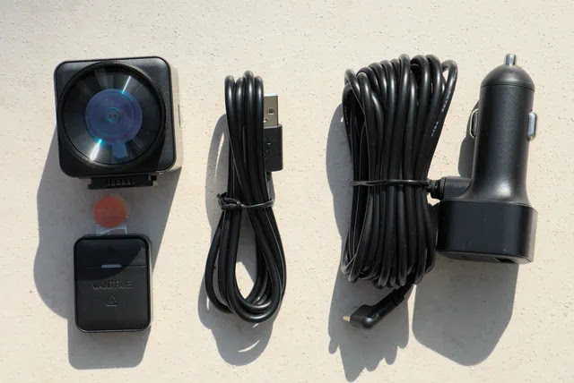

## VANTRUE E1の仮取付け

早速取付けてみましょう。SDカードを差し込みます。

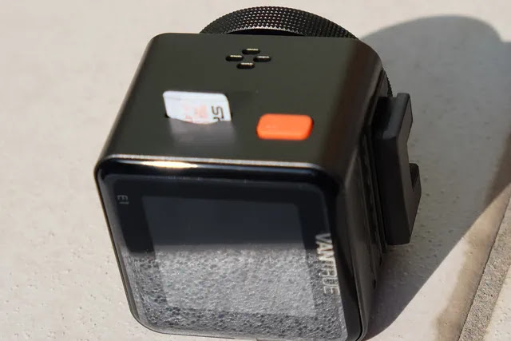

本体にマウントを取付け、電源ケーブルを差し込みます。電源ケーブルのコネクタは、スマホ同様
USB-C
で、マウントに挿しても本体に挿してもOKです。USBなのでモバイルバッテリーとかなんでも行けそうです。

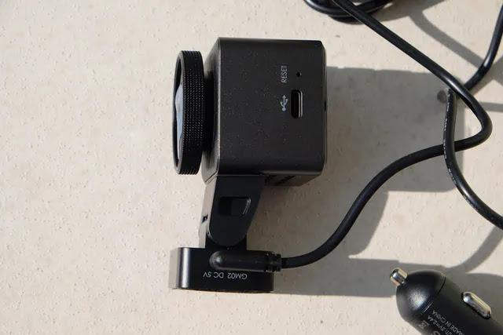

電源ケーブルをシガーソケットに差し込みます。

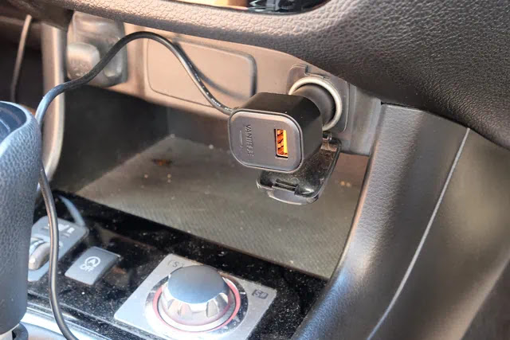

一度テープで仮固定してみます。エクシーガクロスオーバー7はフロントウィンドウ中央上部にアイサイトの大きなカメラが2つあるので取付け位置に迷います。センターだと完全にミラーの裏になってしまうため、アイサイトの右、運転席側にしてみました。

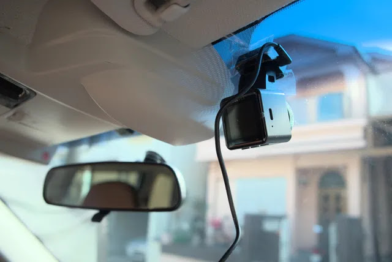

外から見るとこんな感じです。

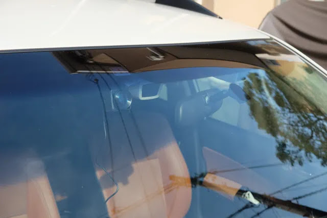

## 電源を入れる

車のACC電源を入れると、ドライブレコーダーの電源も入りました。初回はいろいろ設定項目があります。まずは言語から。英語とフランス語のみです。

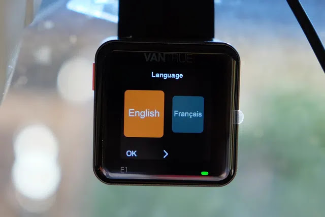

ちなみに、画面をタッチしても反応無し。タッチパネルではなく、本体下面の3つのボタンを押して操作します。上の写真だと、左のボタンが「OK」、中央のボタンが「次を選択」、右のボタンは割当無しです。ちょっと戸惑いましたが分れば単純です。

次はタイムゾーンです。GMT+09:00 Tokyoを選択。

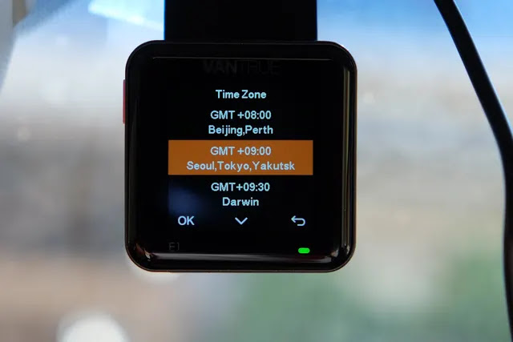

日付の形式を選択。

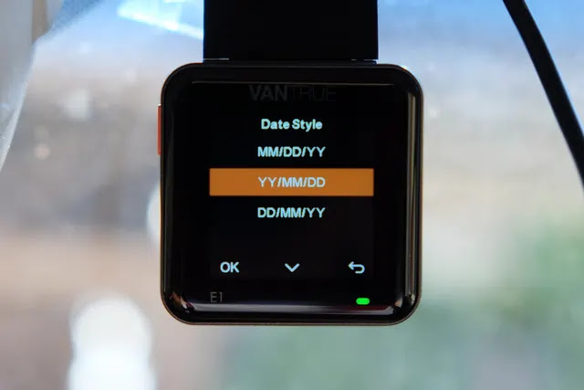

時刻合わせ。

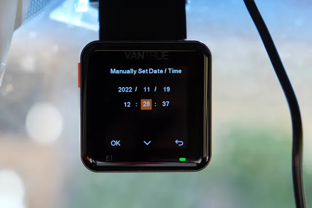

周波数？西日本の電源60Hzにしてみましたが車はDC電源なのでなにか意味あるのでしょうか？？

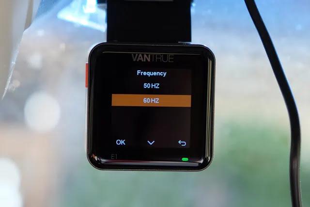

速度の単位です。Km/hに合わせたつもりですが録画された動画にはMPH(マイル/時)が表示されていました。

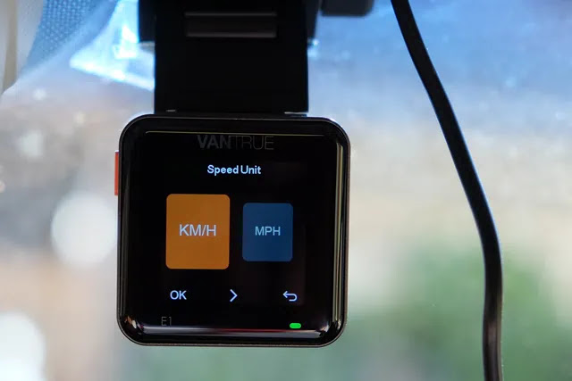

設定が終わったら次はSDカードのフォーマット画面が出てきます。

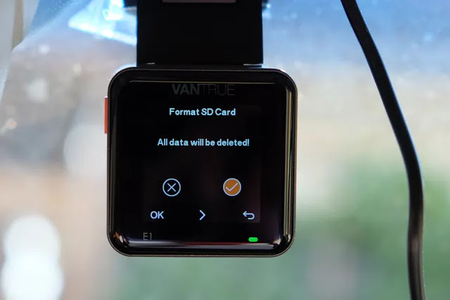

やっと画面が写りました！すでに録画が始まっています。（画面が青いのは、レンズ保護シールをまだ付けたままだからです）

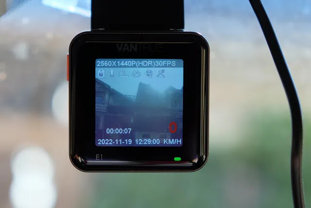

## 本取り付け

位置はとりあえず良さそうなので本取り付けします。まずはフロントウィンドウをガラスクリーナーで拭いてきれいにします。

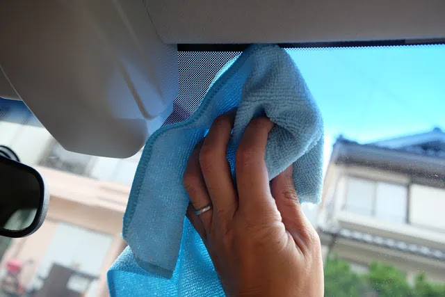

マウントに両面テープが貼られているので、そのままフォロンとウィンドウに貼ると思いきや、下の写真にある静電気接着テープなるものをフロントウィンドウに貼り、その上にマウントを接着するようです。

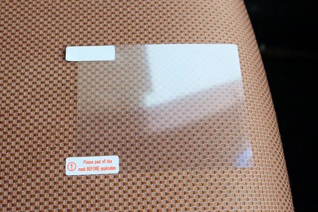

静電気接着テープをフロントウィンドウに貼ります。静電気でゴミが引き寄せられ、なかなか難しく気泡だらけになってしまいました。

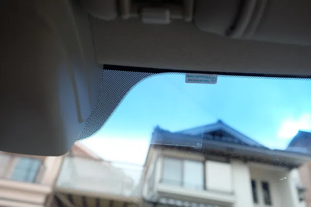

マウントの両面テープを静電気接着テープに貼り付けます。

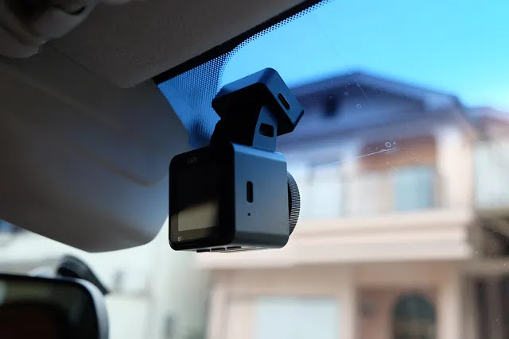

最後にPLフィルターもレンズにねじ込んで取付け完了です。

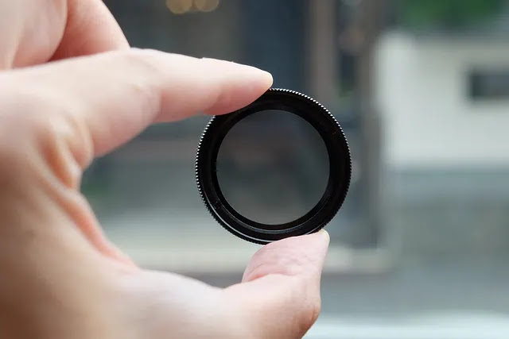

電源ケーブルの処理が必要ですが、とりあえずテープで適当に固定してそのへんを走り試写してみます。問題なければヒューズボックスから電源取り出しケーブルも見えないように施工したいと思います。とりあえず今日はここまで。

## まとめ

VANTRUE 小型ドライブレコーダー E1
はフロントウィンドウに両面テープで貼るだけで簡単に取付けでき、電源もシガーソケットから取るケーブルが付属しているので手っ取り早く取り付けるのであればすぐにできます。

次は道路を走ってみて画質やスマホとの連携などもレポートしてみたいと思います。
