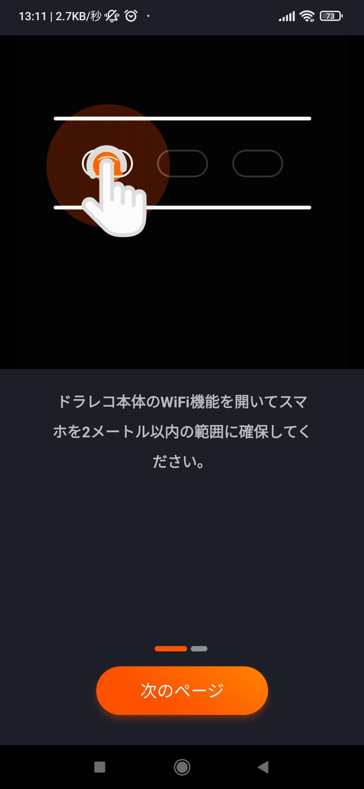
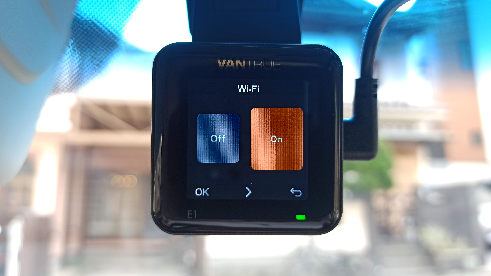
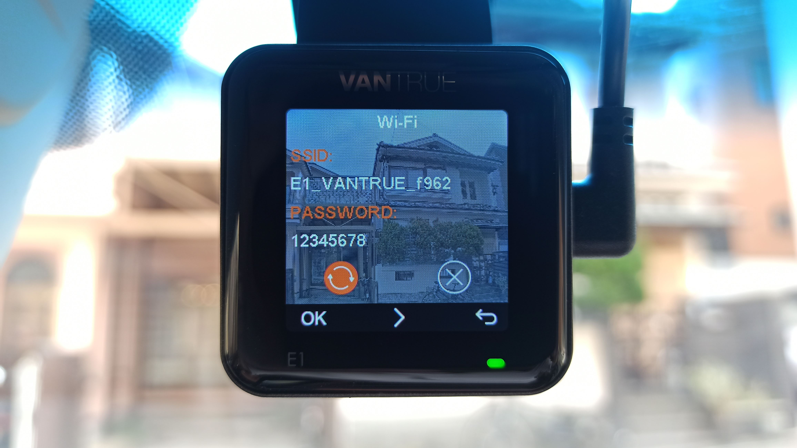
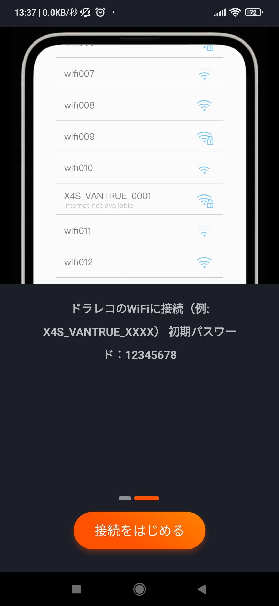
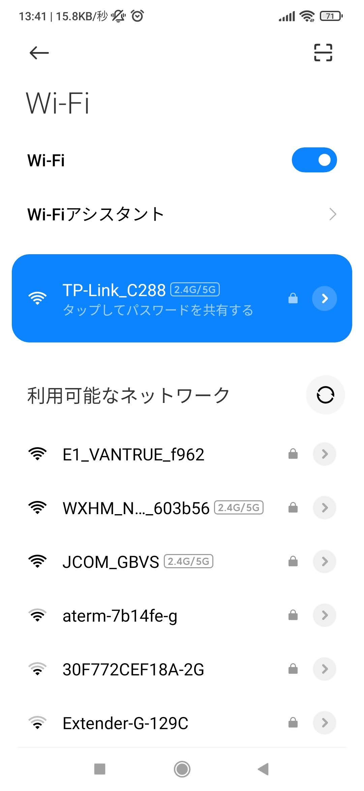
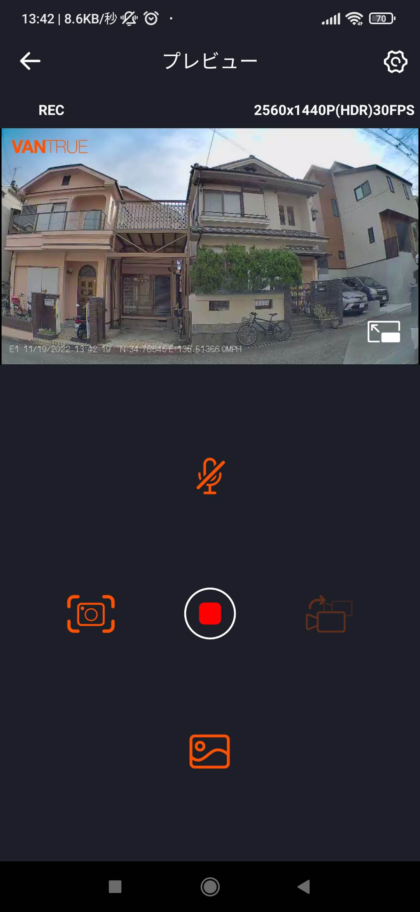
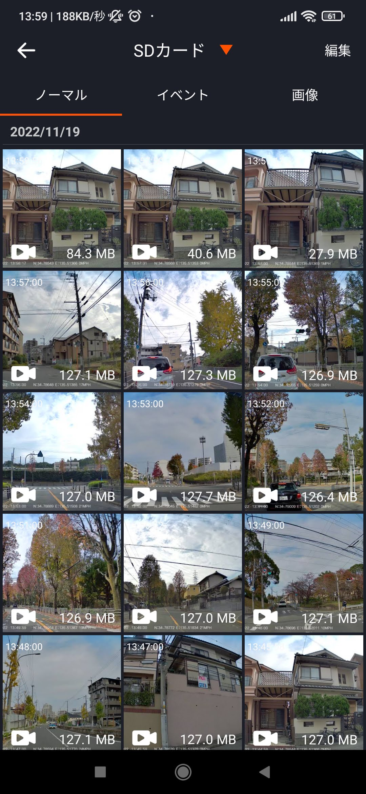
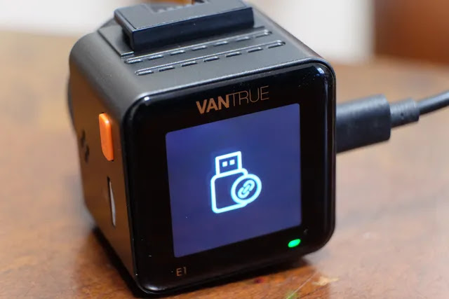

---
categories:
  - 車
  - DIY
date: "2025-02-15T23:43:57+09:00"
description: DIYで取付けしたドラレコ VANTRUE E1 の気になる画質レビューとスマホアプリ操作、動画ダウンロード方法をまとめました。
draft: false
images:
  - images/DSCF7146.webp
summary: DIYで取付けしたドラレコ VANTRUE E1 の気になる画質レビューとスマホアプリ操作、動画ダウンロード方法をまとめました。

tags:
  - ドライブレコーダー
title: ドラレコ VANTRUE E1 - スマホアプリ接続と動画の確認 -
---

DIYで取付けしたドラレコ VANTRUE E1
の気になる画質とスマホアプリ操作、動画ダウンロード方法をまとめました。

## スマホアプリのインストール

[前回の記事](/others/vantrue-e1-1)
でドラレコ VANTRUE E1
をフロントウィンドウに取付け、電源を入れて一通り設定しました。

スマホアプリでドラレコに接続し、操作やビデオ確認ができるようなのでアプリを入れてみました。アプリはiOS、Android用両方ありますが以下Androidのアプリです。Vantrue
Camという名前です。

## スマホアプリと接続

アプリを起動すると早速、ドラレコとの接続画面が出てきます。

ドラレコ側の設定で、Wi-FiをOnにします。

SSIDとパスワードが画面に表示されます。

アプリの「接続をはじめる」をタッチします。

Wi-Fiの設定に「E1 VANTRUE
f962」が出てきました。これを選べば接続できます。が、1回目はいくら待てど接続先が出てこなかったので、一度アプリもドラレコも終了してもう一度やってみたら接続できました。

接続に成功すると、下のような画面が出てきました。上側に録画中の画面があり、下に操作ボタンがあります。録画のON/OFFや、静止画を撮ったりできます。

## 録画の確認

録画した動画も見ることができます。動画は1分ごとに1ファイル作られるみたいでたくさんあると探すのが大変そうですね。。。衝撃があった場合の動画は「イベント」に保存され、上書きされないようです。

## PCとの接続

ドラレコはマウントからワンタッチで外せるので、USB-CケーブルでPCに接続することもできます。接続後は普通のUSBメモリのようにファイルにアクセスできます。

## 画質は？

VANTRUE
E1で撮影した動画のキャプチャです。湾曲はまあまあありますがアクションカメラと比較すると気になるほどではないです。画質はコンデジのようなシャープで色はあっさりとした淡い印象です。フロントウィンドウ越しというのもあるかもしれません。



ちなみにPLフィルターを付けています。画面端の映り込みがありますが、中央付近は映り込みなくきれいです。車を運転していると太陽の方向がどんどん変わるので全部除去するのは難しいようです。

手ブレ補正は全く無いみたいですね。記録が用途なので仕方無いかと思います。

## まとめ

VANTRUE
E1はスマホアプリで動画を見たり、USBでPCに繋いで簡単に動画をダウンロードできます。1分ごとにファイルができるのでやや邪魔くさいですが、ドライブの景色を保存するという用途にも使い勝手が良いと思います。

画質は特別綺麗という印象は無いですが、解像度も高く思ったよりは良かったかな、程度の評価です。
