---
categories:
  - 車
  - DIY
date: "2025-02-15T23:43:59+09:00"
description: 車のドライブレーコーダーをDIYで取付ける際のヒューズボックスからの電源取り出しと内装剥がし配線をきれいに収納する方法を解説します。
draft: false
images:
  - images/32.webp
summary: 先日購入した小型なドラレコ、VANTRUE E1。付属のシガーソケット電源を使い動作確認しましたが良さそうなのでヒューズボックスから電源取り出し本配線をしていきます。
tags:
  - ドライブレコーダー
title: ドラレコ VANTRUE E1 - ヒューズボックスから電源取出し配線 -
---

先日購入した小型なドラレコ、VANTRUE
E1。付属のシガーソケット電源を使い動作確認しましたが良さそうなのでヒューズボックスから電源取り出し本配線をしていきます。

## 用意するもの

ヒューズ電源が必要です。ヒューズから取出す電源は、通常12Vか24VなのですがVANTRUE
E1はUSB-Cによる電源供給で、電圧は5Vです。なのでヒューズ電源からUSB-Cへの変換アダプタも必要です。VANTRUEからこれらが含まれた純正の電源ケーブルが売られているのでこれを購入しました。様々なタイプのヒューズに対応したケーブルが含まれています。（写真左上）

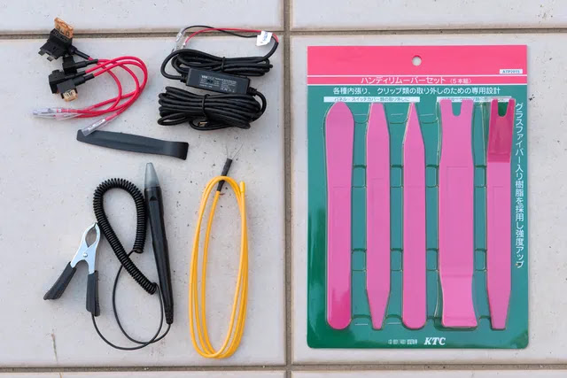

工具は、内装剥がしと検電テスターが必要です。写真の黄色いワイヤー、配線ガイドがあると線を通しやすくなりますが今回は手で簡単に線を通せたので結果使いませんでした。

写真にないですがアース用にドライバーとコンビネーションレンチ、Aピラーの取外しにマイナスドライバーを使いました。

## ヒューズプライヤーの取出し

ヒューズを抜くためにヒューズプライヤーが必要になりますが、この車（スバル　エクシーガクロスオーバー7）の場合はエンジンルームのヒューズボックスに装備されていますのでまずはヒューズプライヤーを取出します。

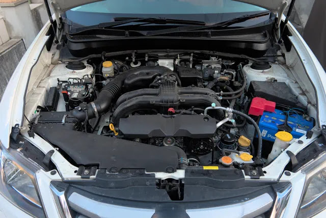

バッテリーの奥にある黒い部分がヒューズボックスです。

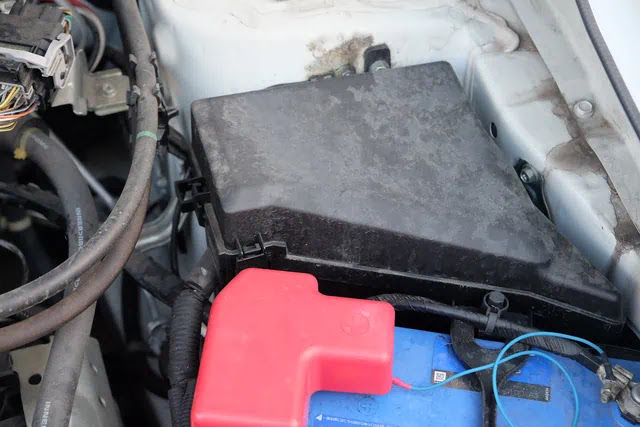

中央付近の白い洗濯ばさみのようなものがヒューズプライヤーです。

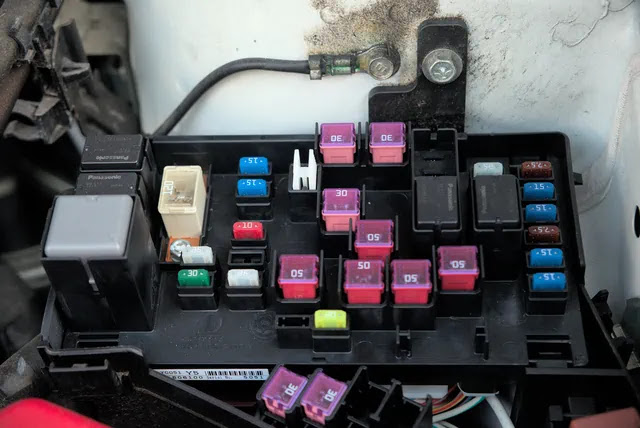

こんな工具です。

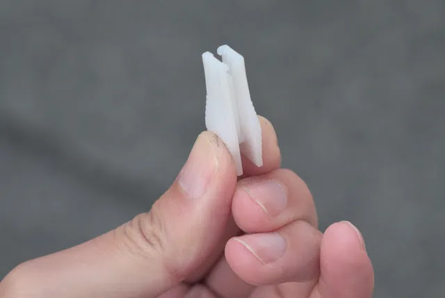

ヒューズボックスの蓋に予備のヒューズがあったので、ヒューズ電源のどれを使うか比べてみます。ヒューズには形がいくつかありますが、これはミニ平型ヒューズというものです。

## ヒューズボックスの場所を確認

必要な物が揃ったところで早速作業していきましょう。まずは室内のヒューズボックスを探します。場所は車の取扱説明書に書いてあります。この車はハンドル右下のETCが入っているパネル裏になります。ETC無しの場合はコイントレイになっているみたいです。

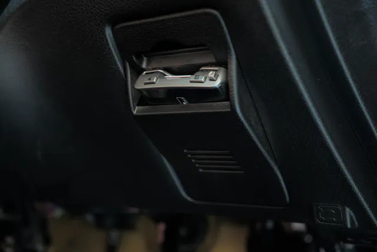

パネルを引っ張って外すとヒューズボックスが見えました。

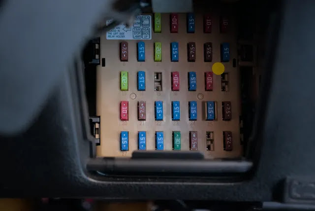

## パネル、Aピラーの取外し

次に配線を通すためにエンジンスタートボタン側面のパネルを外します。

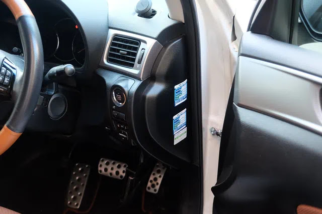

内装剥がしを突っ込んでみると簡単に取れました。

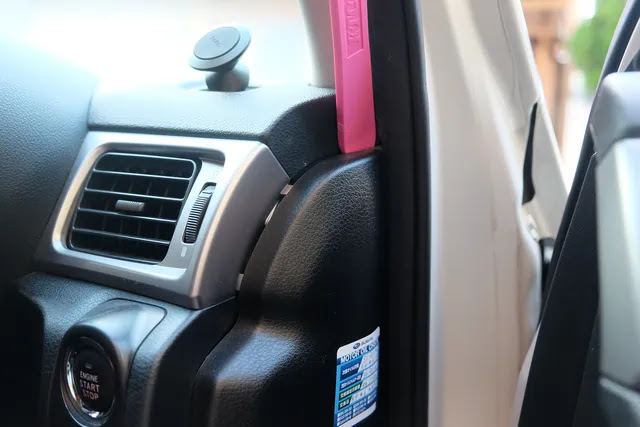

パネルを外した状態です。

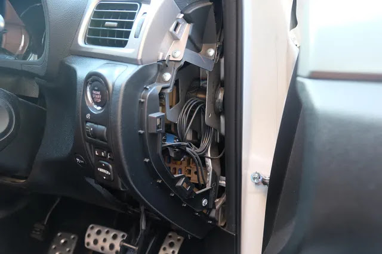

次はAピラーです。エクシーガクロスオーバー7の場合、ここがちょっと厄介でした。まずは扉とのゴムパッキンを引き抜きます。

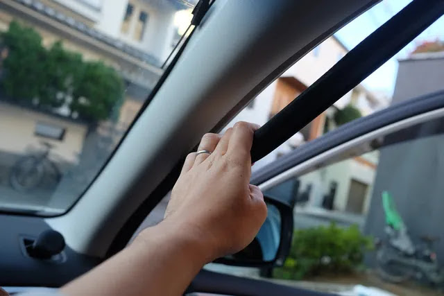

内装剥がしを上から突っ込みます。

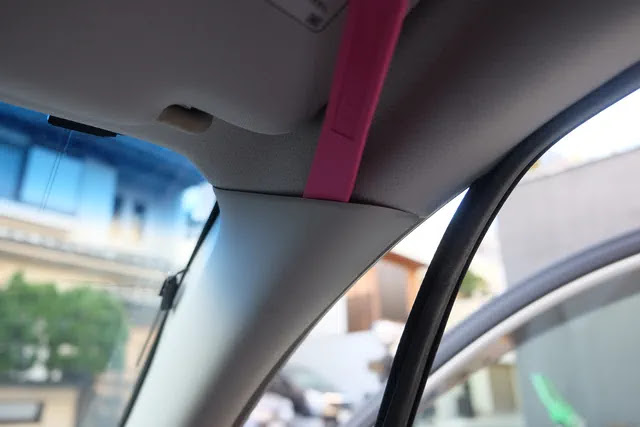

上を開くと、何かに引っかかっていてカバーが外れません。隙間から覗き込むと下の赤丸の部分に引っかかりがあり、これを外すのに苦労します。

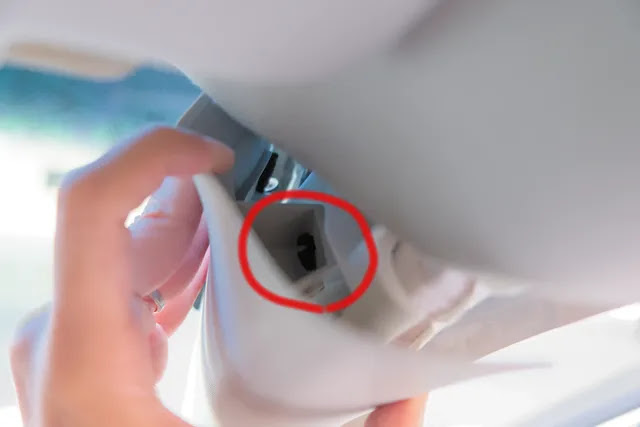

カバーを外したあとの写真です。黒い部分にカバーが引っかかっていました。

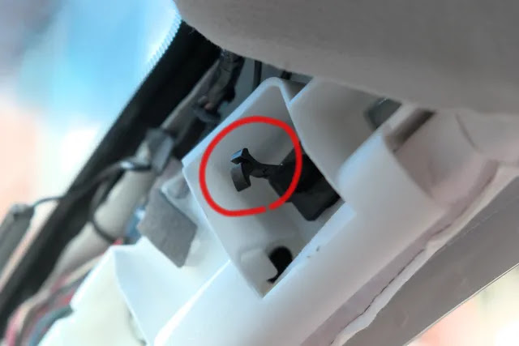

カバー側は長方形の穴があいています。

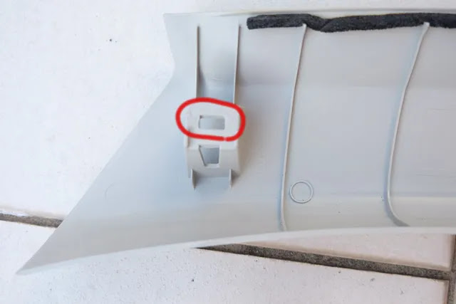

黒い爪が、下の画像左のように、カバーの穴に対して90°回転した状態で引っかかっています。この爪をねじり、画像右側のようにすると外すことができます。

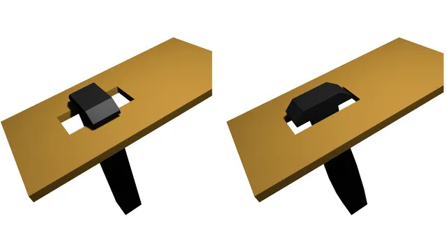

しかし少ない隙間からこの作業を行うのが難しく、ネットで見ると皆様いろいろ苦労されているようです。隙間から指を突っ込みねじり、外れそうになったところでマイナスドライバーで押し込み外すことができました。

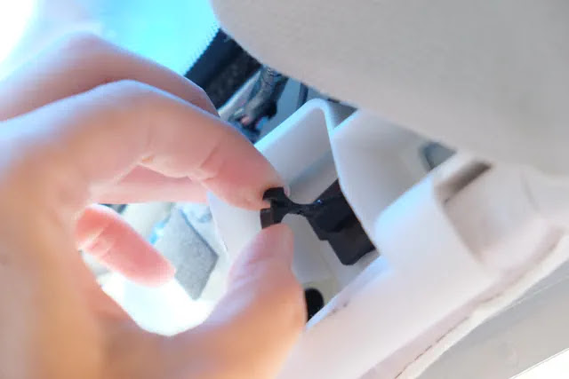

Aピラーのカバーが外れました。

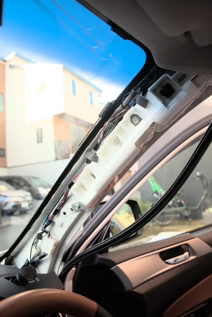

## ヒューズ電源を取付け

ヒューズボックスのどこから電源を取るかを決めます。このドラレコには停車時に人の動きを検知して録画するなど、防犯のための機能があります。これを利用するには常時電源を利用しますが今回は走っているときだけ録画できればよいので、ACC電源から取ることにします。No.20シガーソケット用のヒューズから電源を取ります。

先ほど確保しましたヒューズプライヤーを使ってNo.20のヒューズを取り外します。

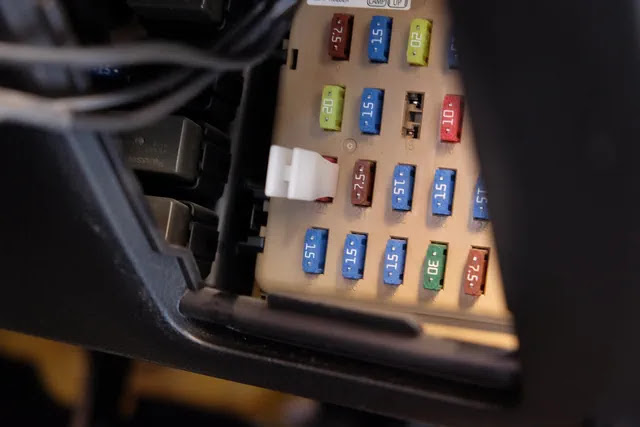

抜いた10Aのヒューズです。

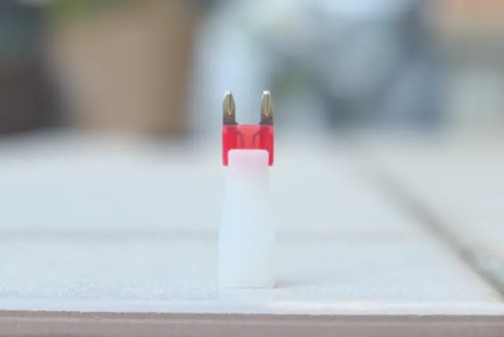

抜いたヒューズをヒューズ電源に差し込みます。下の赤矢印の穴です。下にあるオレンジ色のヒューズは、ドラレコ用のヒューズになります。

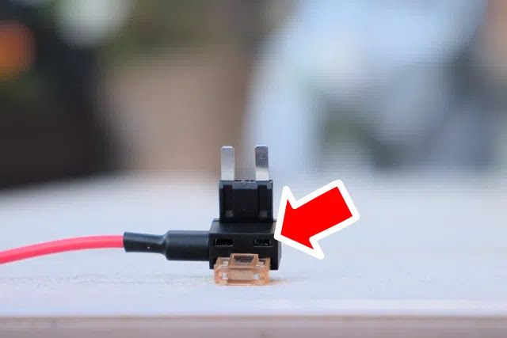

ヒューズを差し込みました。

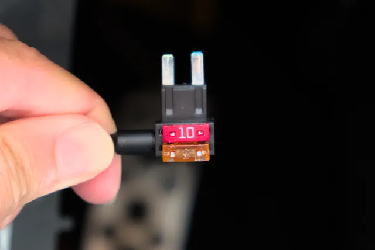

検電テスターで電源側がどちらかを調べます。

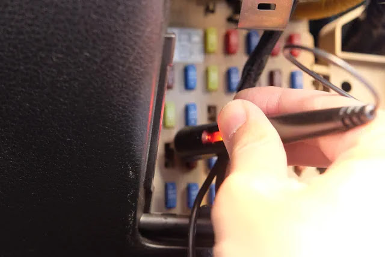

ヒューズ電源を差し込みます。付属の取説には「正しい向きに取り付ける」とだけ記載があるのですが、どっち？？エーモンのサイトを見てみる（これはVANTRUE純正のヒューズ電源ですが）と、分岐の赤いケーブルが電源側になるのが正しいようです。下の写真は逆向きなのですが、反対向きだとカバーに干渉してしまったのでこの向きにします。

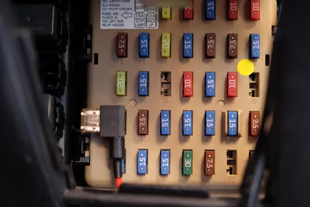

もとの10Aヒューズにもドラレコ用の電流が流れてしまうので、シガーソケットの容量が減ってしまいますがそもそもシガーソケットを使うことが無いのでこれでよしとします。

## ドラレコからヒューズ電源までの配線

ヒューズ電源からUSB-Cに変換するアダプターです。ドラレコからヒューズ電源まで線を通していきます。

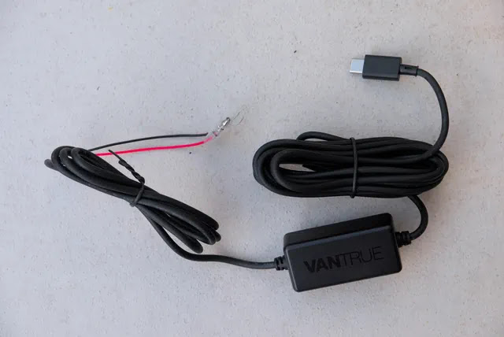

まずドラレコ側にUSB-Cコネクタを差し込みます。

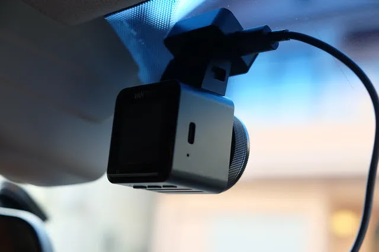

配線をパネルの裏側に押し込みます。

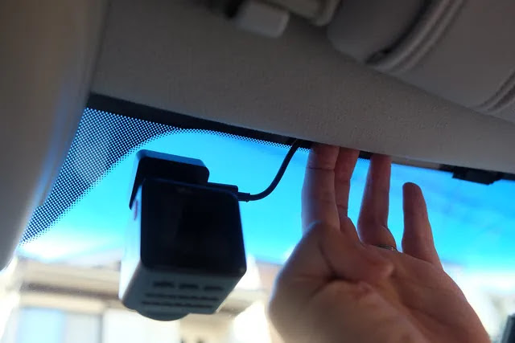

配線をAピラーの他の線に添わせて下へ通していきます。

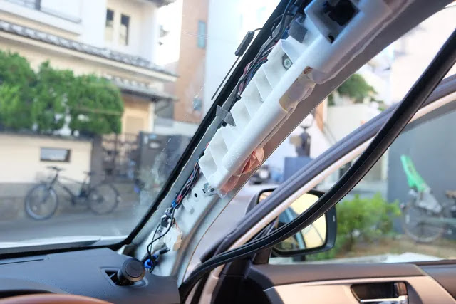

配線をインパネの中に通していきます。

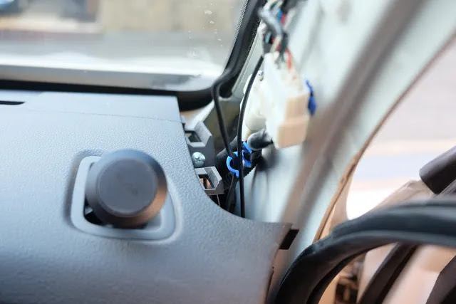

四角いボックス部分はこんな感じで付属の両面テープで接着固定しました。

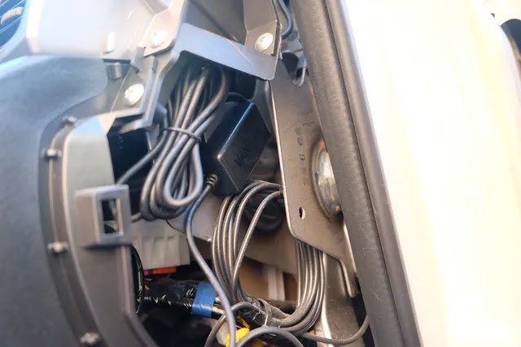

## アース、プラスのギボシを接続

ここまでくればあとはマイナス、プラスの線をそれぞれアース、ヒューズ電源に固定するだけです。

まずマイナス端子のアースです。ボディの適当なボルトに共締めしてしまえばよいのですが、近くに良さそうなボルトが見当たらなかったため、捨て穴のように空いている穴を利用します。

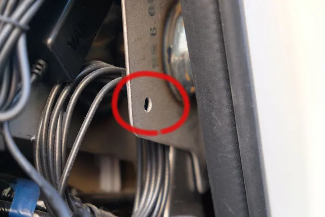

ボルト、ナットを準備します。

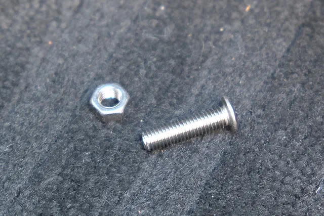

アース端子をボルトナットで板金に固定しました。

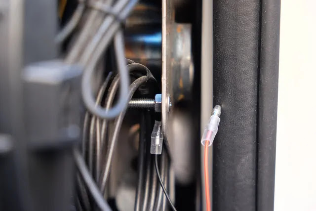

プラスの線はギボシになっているので、ヒューズ電源とつなぎます。

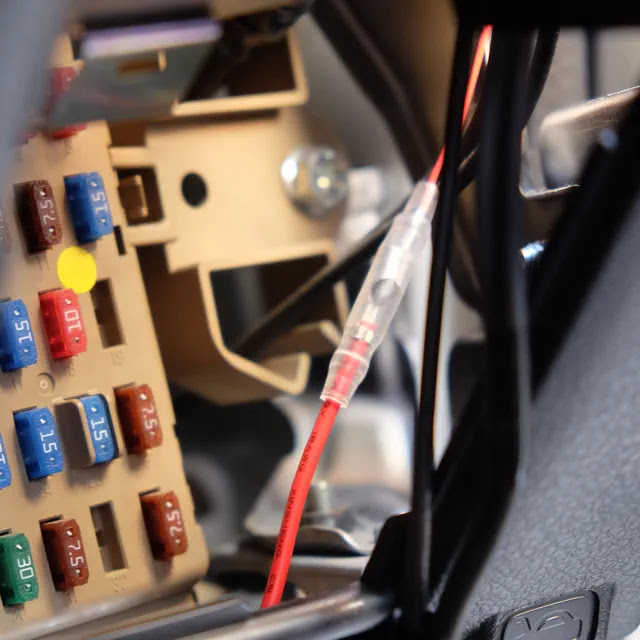

線がけっこう余ったのでこんな感じで詰め込みました。。。

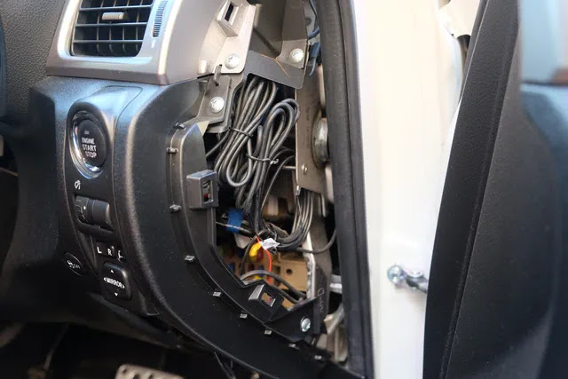

## パネルを戻して完成！

パネルを戻して完成です！配線が内装パネルの中を通りすっきりしました。

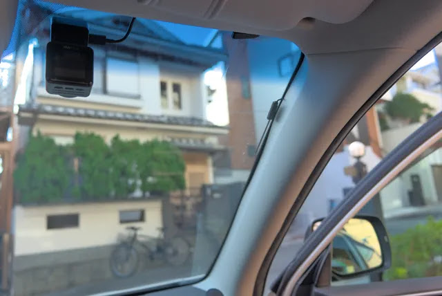 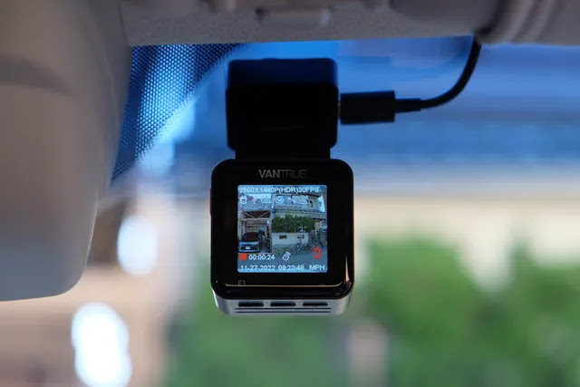

## まとめ

小型ドラレコ、VANTRUE
E1をヒューズ電源を使って配線を内装パネルの中に入れてきれいに設置することができました。ヒューズ電源は、取説で場所さえ分れば簡単に取付けでき、内装剥がしも車種ごとにネットに情報がたくさんあるので初めてでも失敗せずにできました。

安価に取付けることができ、画質もそこそこ良くキューブ型でスタイリッシュなVANTRUE
E1でドライブの記録をしていこうと思います。事故で使うことが無いことを祈って。。。
