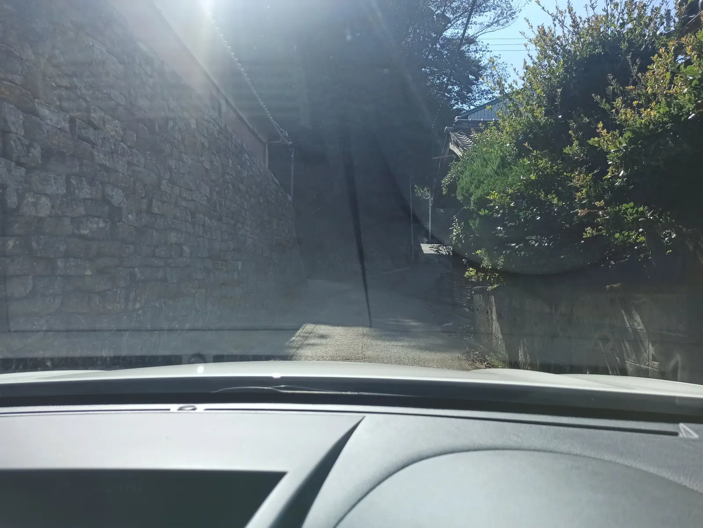
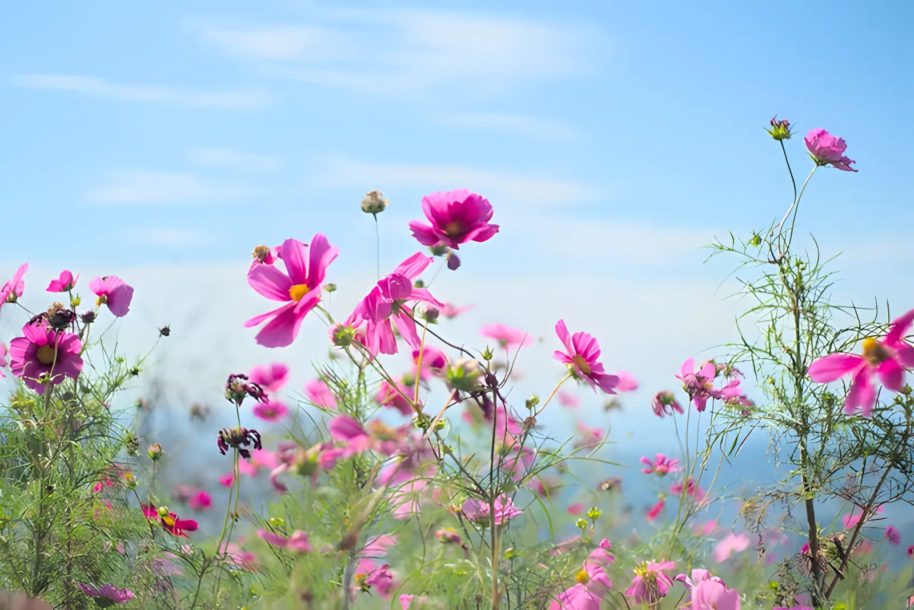

---
categories:
  - アウトドア
date: "2025-02-15T23:43:27+09:00"
description: 和歌山県有田川町のコスモスの名所、鷲ヶ峰コスモスパークい行きました。山の開けた頂上にあり、コスモスの咲くお花畑から下の町や海が見える絶景のスポットです。
draft: false
images:
  - images/DSCF5137.webp
summary: 和歌山県有田川町のコスモスの名所、鷲ヶ峰コスモスパークい行きました。山の開けた頂上にあり、コスモスの咲くお花畑から下の町や海が見える絶景のスポットです。
tags:
  - コスモス
  - 花
  - 和歌山
  - 家族でお出かけ
title: 天空のお花畑 鷲ヶ峰コスモスパーク
---

和歌山県有田川町のコスモスの名所、鷲ヶ峰コスモスパークい行きました。山の開けた頂上にあり、コスモスの咲くお花畑から下の町や海が見える絶景のスポットです。途中の道が細いためアクセスが少し大変ですが関西のコスモス名所として一見の価値あるスポットです。

## アクセス



鷲ヶ峰コスモスパークへは、阪和自動車道有田ICで降り、南側から阪和自動車道のトンネル真上あたりの道を登っていくのが一般的なルートです。今回は北側の下津ICから行きましたがみかん畑の道が狭く南側からのほうがアクセスしやすいでしょう。

いずれのルートでも最後は東へ折れ対向車のすれ違いが困難な一本道を3〜4Km走ることになり、コスモスシーズンは車がたくさん通るため運転は注意が必要です。

アクセスルートについては
[有田川町のホームページ](https://www.town.aridagawa.lg.jp/top/kakuka/kanaya/9/2/koen_camp/621.html#wrapper)
を確認しておくとよいでしょう。

## 下津ICからみかん畑を通り鷲ヶ峰コスモスパークへ

道の情報をろくに確認せず、ナビをセットし鷲ヶ峰コスモスパークへ向かいました。大阪からは、北側からのアクセスになるため、おすすめの有田ICからではなく、1つ手前のトンネルの間にある下津ICで高速を降りました。

少し山を登るとみかん畑の中を通っていきます。地元のみかん農家の人が使う道といった感じで、車1台が通れる狭い箇所もたびたび出てきます。

下の写真ではわかりにくいですが、山の斜面にみかん畑が広がる絶景がみられます。

コスモスの咲く時期はちょうどみかんの収穫の時期と重なり、みかんがたくさん成っている木を見ることができました。

道は狭いですが、こちらから来る車は少ないのですれ違いに苦労することは無く無事通過できました。

しかし終盤の、東へ折れ鷲ヶ峰コスモスパークへ向かう1本道は南から来る車と合流しなおかつ道幅も狭くすれ違いできない箇所も多いため、車と出会ってはどちらかがバックし道を譲るといった進み方で大変でした。

行きは余裕が無く写真を撮れませんでしたので下の写真は帰り道ですが、こんな感じでとても狭い道を進む中で対向車がどんどん来るというなかなかハードな道です。

## 山上に咲くコスモスと眺望

ちょうどお昼に鷲ヶ峰コスモスパークへ着きました。駐車場も広くはないため、誘導員さんが出る車と入る車を交互に案内しています。帰りの1時前頃になると入口には車の待ち行列ができていましたのでなるべく早い時間に行くのがおすすめです。

駐車場です。あまり広くは無く、ここと奥、そして手前の下の3箇所程度あり、駐車できるのは4，50台くらいでしょうか。

駐車場からすぐ目の前にコスモスと風の館が見えます。みかんやみかんジュースなどが売られていました。右側に遊具があり子供はコスモスを見るだけでは物足りないのでありがたいです。

頂上から広がるコスモス畑、眼下には有田川とその先の海が見渡せます。

下からコスモスと風の館を見上げます。建物の右上が顔と目のように見えますが羽を広げた鷲をイメージしているのでしょうか？

コスモス畑はそれほど広くは無く、道がありますがすぐに回れてしまいます。

みかんジュースを買って飲んで休憩です。ところどころにベンチがあり、おべんとうを食べている人もちらほらいます。

去年行った大阪府豊能町のとよのコスモスの里より小ぶりで花の密度も低い（年によるのでしょうが）ですが眺めがよく気持ち良いのと、駐車場に制限があるのでそれほど混んでいる印象で無いのもよいところです。

遊具で少し遊んで帰ります。

## 帰りは有田ICへ

帰りは南側の有田ICへ下ります。鷲ヶ峰コスモスパーク付近の道は相変わらずすれ違い困難で何度も止まったりスレスレでヒヤヒヤしたりの繰り返しでしたが、T字路まで戻り、左折し南側に下る道は開けていて安心して走れました。

途中に風車が見えてその大きさにびっくりです。

## まとめ

鷲ヶ峰コスモスパークは、山上のコスモスの咲くお花畑と眼下に広がる絶景が見られるスポットでした。途中のみかん畑や風車も見どころです。途中にコンビニ等何も無いのでおべんとうを持って行くとゆっくりできるかもしれません。

