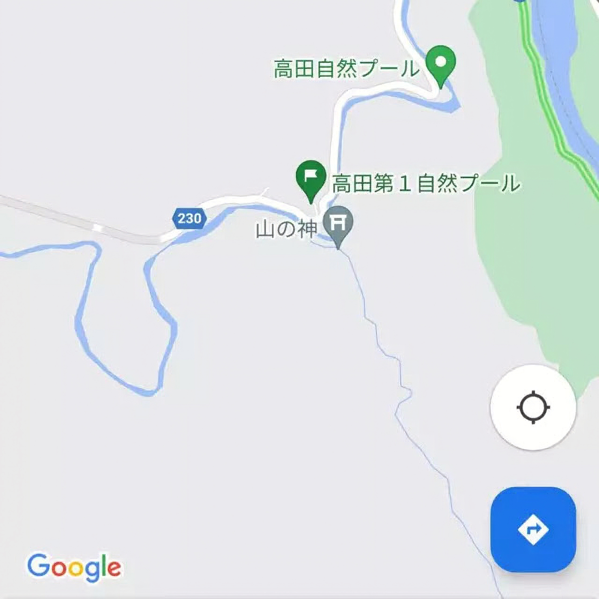
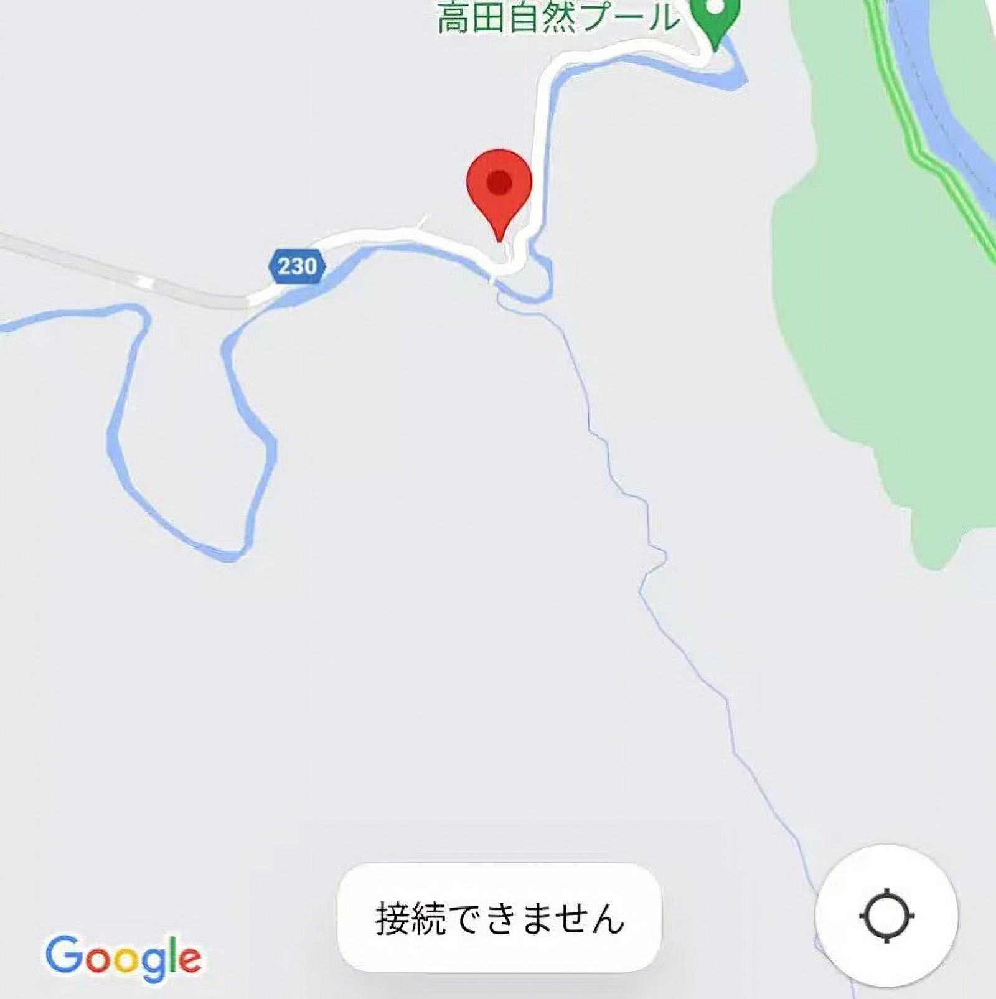
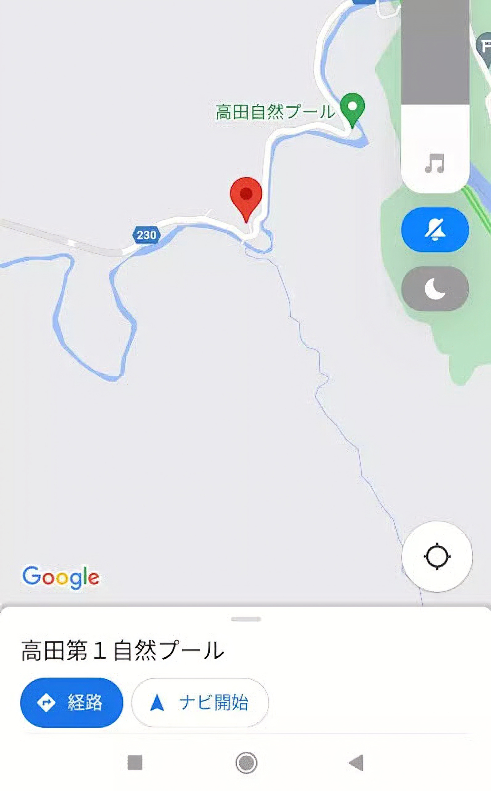
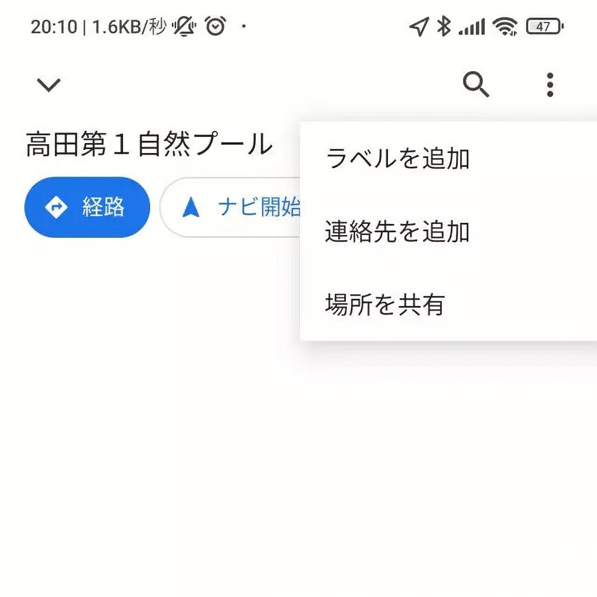
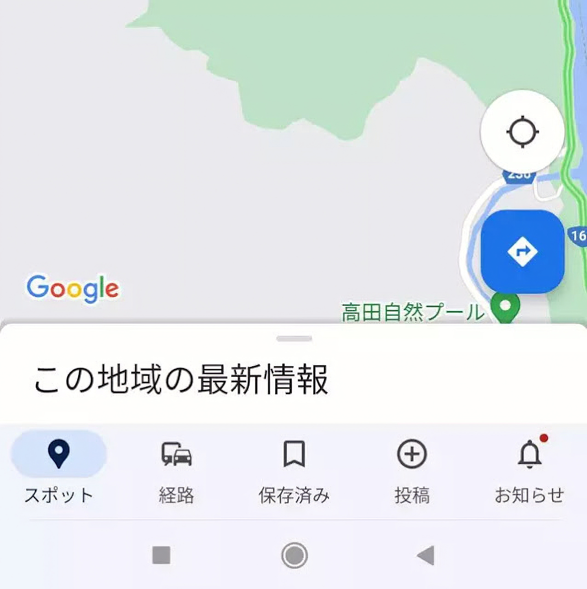
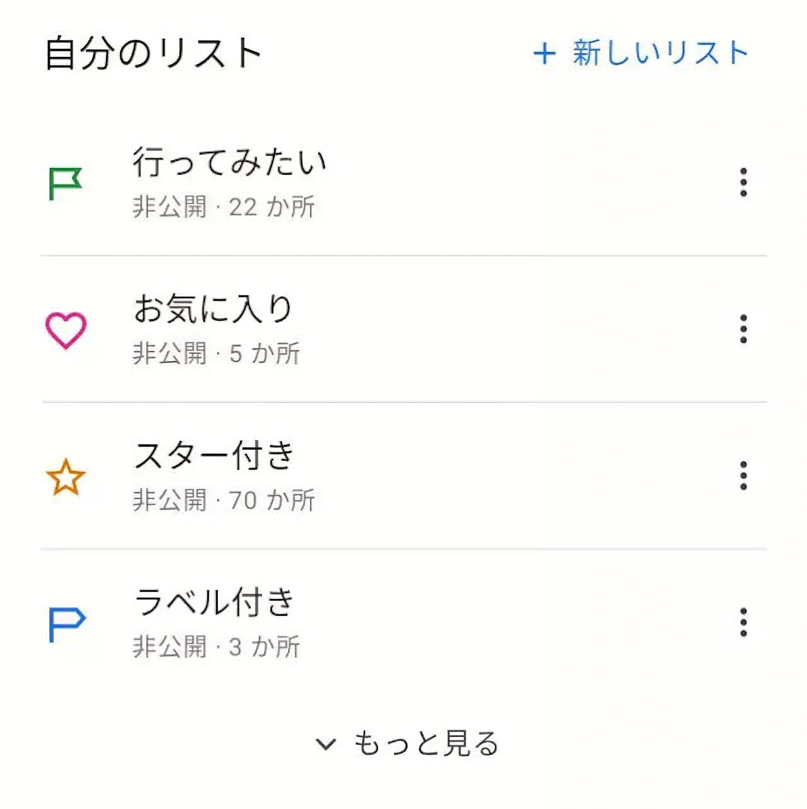
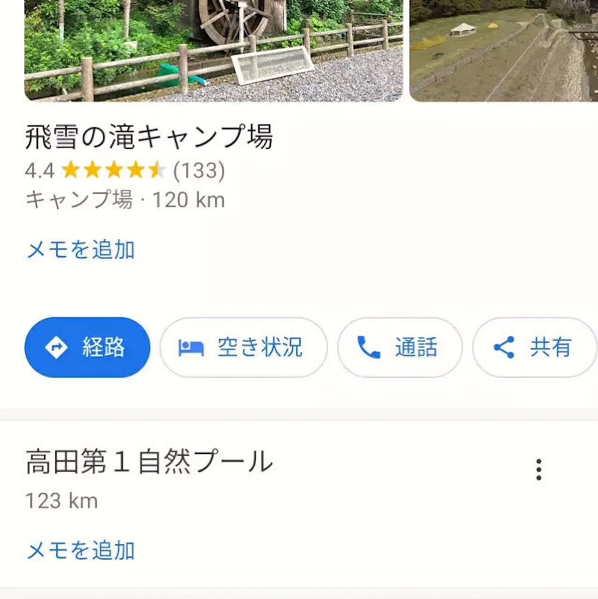
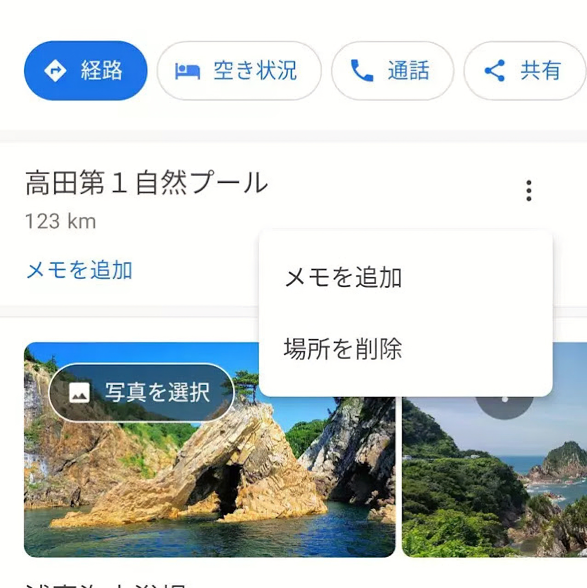
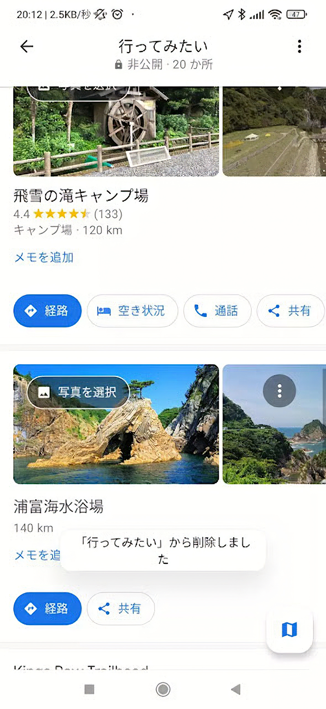

---
categories:
  - Webサービス
date: "2025-02-15T23:43:39+09:00"
description: Googleマップで「お気に入り」、「行ってみたい」、「スター付き」の登録した場所が削除できなくなった場合の対処法を解説します。
draft: false
images:
  - images/undraw_my-current-location_tudq.png
summary: Googleマップで「お気に入り」、「行ってみたい」、「スター付き」の登録した場所が削除できなくなった場合の対処法を解説します。
tags:
  - Googleマップ
title: Googleマップで保存した場所を削除できなくなったときの解決法
---

地図アプリといえばとにかく便利なGoogleマップ。外でナビや乗換案内として活用したり週末の旅行先を考えたりとGoogleマップ無しでの生活は考えられなくなってしまいました。

Googleマップには、「お気に入り」、「行ってみたい」、「スター付き」など、場所を保存しておくことができるので興味を持った場所に「行ってみたい」をマークしておいて実際に訪問したら削除したり「お気に入り」にしたりという使い方をしていました。

しかし、いくつか何故か削除できない場所があり、放置していましたがこのたび削除する方法が分かったのでメモとして記事にします。

## どうして一度登録した場所を削除できなくなるのか

問題となった場所を実例として紹介します。

紀伊半島、和歌山県の熊野川に合流する高田川に高田自然プールという場所があり、夏に訪れてみたいと思いました。「高田第1自然プール」を「行ってみたい」場所として保存しました。

そして数年が経ち、この場所を選択してみると、「接続できません」のメッセージが。

こうなってしまうと場所の「保存」ボタンも現れなくなってしまい、「行ってみたい」を消すことができません。

おそらくこの場所自体がGoogleマップから削除されてしまったので「行ってみたい」のマークだけが残っているが操作できなくなってしまったのだと思われます。場所に関する情報も表示されず、操作もできません。

他にも確認してみたらマイナーそうな場所でいくつか同じ事態になっていました。

## 削除方法

マップ上でどの場所も選択していない状態で画面下に出ている「この地域の最新情報」の保存済みをタップします。

「自分のリスト」の中から「行ってみたい」を選択。

「行ってみたい」で保存した場所のリストが現れるので、その中から削除する対象「高田第1自然プール」を探します。

メニューから「場所を削除」を選択します。

削除できました。

## まとめ

Googleマップで保存した場所が「接続できません」となり削除できなくなってしまった場合には、一度どこも選択しない状態で「自分のリスト」から保存した場所を探せば削除することができます。
