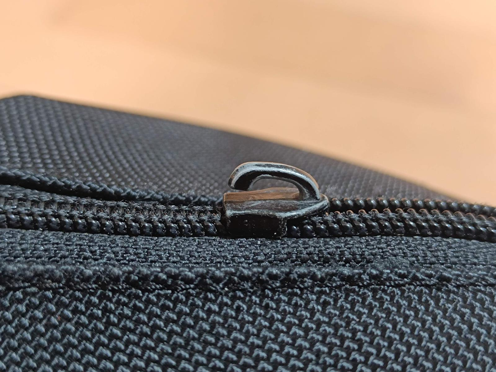
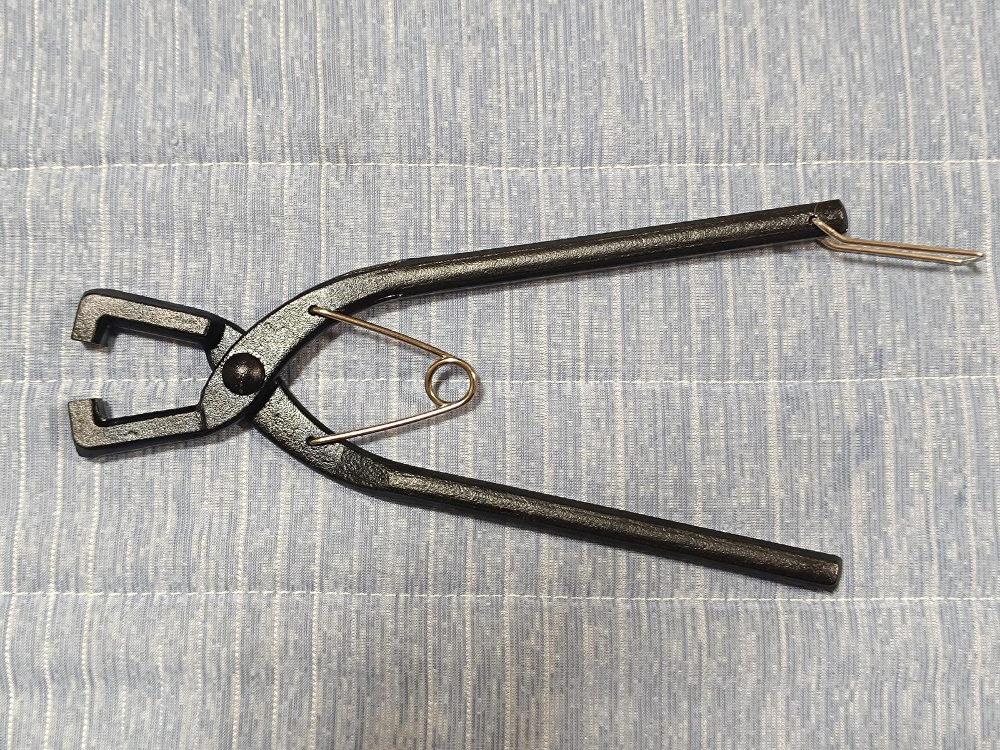
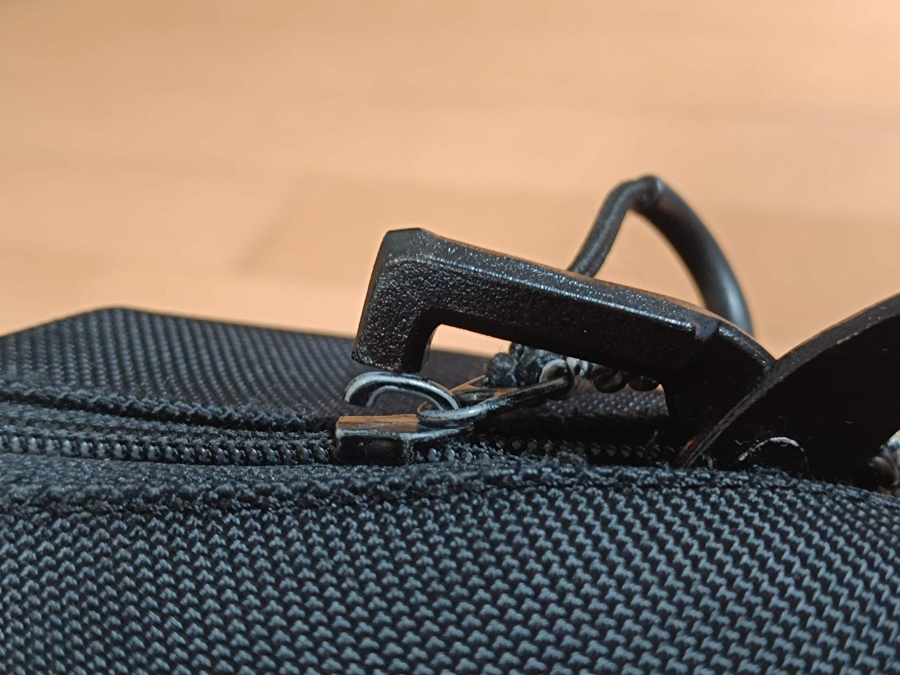
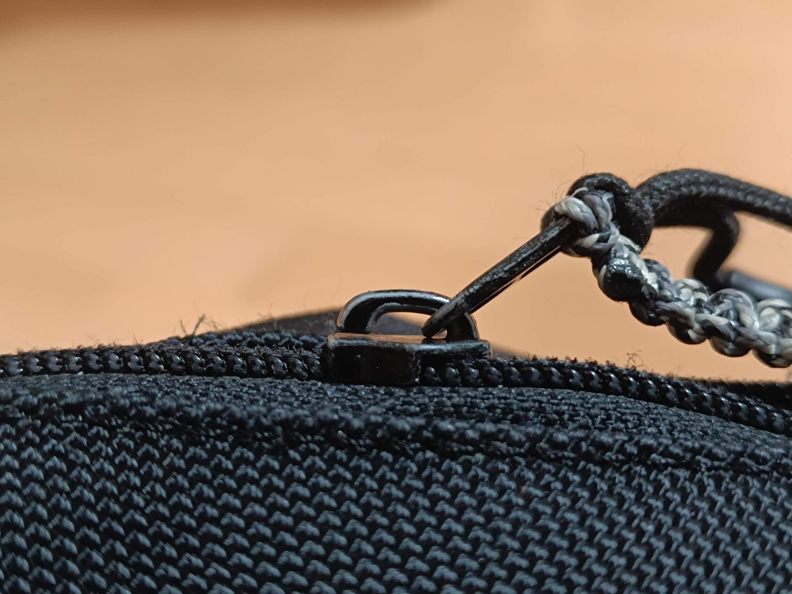

長年使っていたかばんのチャックに付いている引き手が取れてしまいました。よく見ると、スライダが開いてしまっています。

そんなときに便利なのが「口金つぶし」という工具。

もともとは「がま口」を取り付けるための工具のようです。先端がちょうどチャックのスライダの開いた部分を潰すのにいい感じの形状になっています。



こんな感じでチャックのスライダを挟んでつぶします。

直りました！

普通のペンチだと力をかけたいところにうまく力がかからず、変に変形してしまったのかチャックの動作が固くなってしまった経験があります。「がま口」を作る人はあまりいないと思うので、これ専用の工具、になってしまいますが値段も高くないため持っておくといざというときに役立ちます。

チャックが壊れてかばん買い替え、というのももったいないのでこの工具代の元は取れたきがします！
